# 大模型检索增强生成

## **LangChain: Chat with Your Data**

**RAG（Retrieval-Augmented Generation）检索增强生成**

RAG是一种结合信息检索与生成模型的架构。它通过先从数据库或文档中检索相关信息，然后将这些信息与生成模型结合，生成更准确、上下文相关的回答。这种方法在处理开放域问答、对话系统等任务时，能显著提升生成内容的质量和相关性。

在RAG中，也有很多的开源框架可供使用，比如说从开始就很火的**LangChain**，有现在后期比较常用的**LlamaIndex**。那在这门课程中，我们将基于LangChain来实现一些基本的工作。

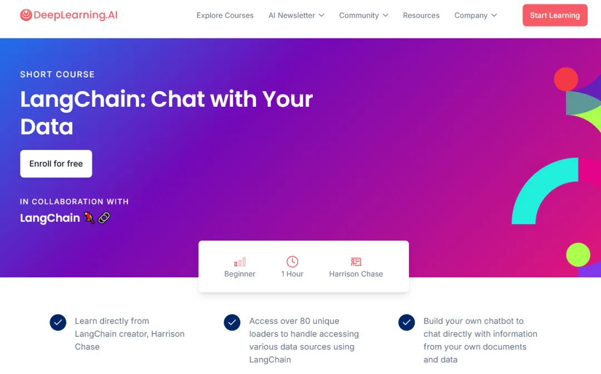

**LangChain概述**

LangChain是一个基于Python的开源框架，旨在简化构建基于语言模型的应用，具有模块化设计、数据源集成和链式调用等特点。它支持多种语言模型的使用，适合开发聊天机器人、问答系统等自然语言处理应用，提供了丰富的文档和示例，便于快速上手。

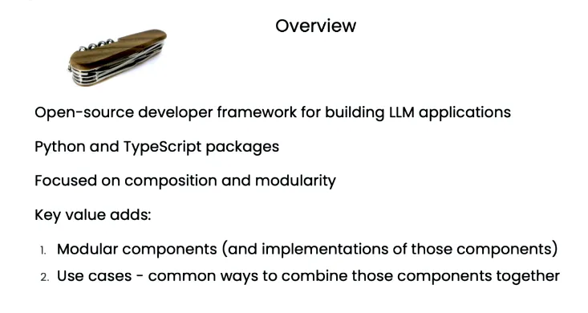

根据LangChain 的主要组件可以分为以下几类，那我们在这门课主要学习的是关于Indexes索引部分的内容：

1. **Prompts（提示）**：
   - 提示模板（Prompt Templates）：用于生成模型输入。
   - 输出解析器（Output Parsers）：包含5种以上的实现，用于处理生成结果。
   - 示例选择器（Example Selectors）：超过5种实现，用于选择适合的输入示例。
2. **Models（模型）**：
   - 大型语言模型（LLMs）：支持超过20种集成。
   - 聊天模型（Chat Models）。
   - 文本嵌入模型（Text Embedding Models）：有10+种集成。
3. **Indexes（索引）**：
   - 文档加载器（Document Loaders）：有50多种实现，用于处理各种类型的文档。
   - 文本分割器（Text Splitters）：10多种实现，用于对文本进行分段处理。
   - 向量存储（Vector Stores）：支持10+种集成。
   - 检索器（Retrievers）：有超过5种实现或集成。
4. **Chains（链条）**：
   - 可以作为构建其他链条的基础模块。
   - 提供超过20种不同类型的应用程序特定链条。
5. **Agents（代理）**：
   - 支持5种类型的代理，帮助语言模型使用外部工具。
   - 代理工具包（Agent Toolkits）：提供超过10种实现，代理通过特定工具执行任务。

这些组件共同构成了LangChain的核心架构，帮助开发者轻松构建复杂的语言模型应用。


RAG 的全流程可以分为两个主要阶段：**向量存储加载**和**检索生成**。

1. **向量存储加载（Vector Store Loading）**：
   - 首先，系统从不同的数据源加载文档。这些数据源可以包括URLs（网站链接）、PDF文件、数据库等各种文档形式。
   - 加载的文档经过处理后，会进行**分割（Splitting）**，将长文档拆分为多个较小的片段，便于后续的检索和匹配。
   - 这些分割后的文档片段会被转化为向量表示，并存储在向量存储（Vector Store）中。向量存储是基于嵌入技术的高效存储方案，能够让文档的内容以数值形式表示，便于后续的相似性搜索和检索。
2. **检索生成（Retrieval-Augmented Generation）**：
   - 在用户输入问题（Query）后，系统会通过向量存储来检索与问题最相关的文档片段（Relevant Splits）。
   - 检索到的相关片段会被组合成一个提示（Prompt），该提示连同上下文一起传递给大型语言模型（LLM）。
   - 最后，语言模型根据检索到的片段生成答案，并返回给用户。

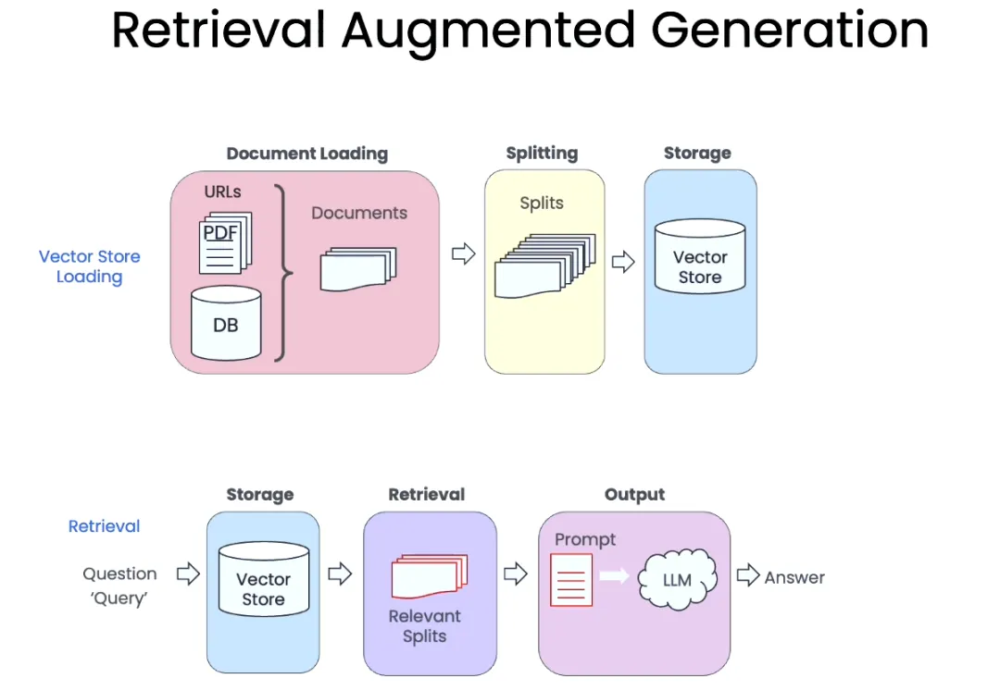

其实我一直觉得说，RAG（检索增强生成）应用的基础搭建确实相对简单。通过利用现有的开源框架，我们只需要将文档导入系统，选择一个合适的嵌入模型进行向量化处理，然后将这些向量存储在RAG库中。调用模型时，先把用户问题传递给RAG模块，检索出相关的信息，再结合大语言模型生成回答即可。**这一过程使我们能够轻松将大语言模型与现有数据结合，提供更精准的回答**。

例如，像我之前参与过的超星集团培训项目中的AI助教，其能在平台上与学生进行对话，并基于课程资源反馈问题的答案。很多老师以为这些AI助教在上传数据后经过了重新训练，使模型更专业化，但其实，背后的原理是将老师上传的内容作为知识库，通过RAG技术检索相关信息，并将其传递给大语言模型，生成回答。整个过程中，大语言模型本身并没有发生变化，唯一变化的部分是通过RAG检索后传入模型的提示词内容变得更为精准。

类似的情况我也在装配式建筑企业的调研中见到过，他们开发的RAG系统通过收集大量装配式建筑的资料，实现了更专业化的问答功能。RAG的火爆不仅在于其技术实现门槛相对较低，还因为它能够明显提升语言模型的应用效果。

但要真正做好RAG并不是一件容易的事。**“茴香豆”项目**的负责人白座曾多次提到，虽然RAG系统的基础搭建很简单，但**要实现高效、稳定，并且符合安全性要求，尤其是保证内容符合社会主义核心价值观，仍然需要在输入输出的各个环节投入大量的精力和心思**。简而言之，尽管技术门槛不高，但想要打造一个效果优异、安全性强的RAG系统，依然是一项复杂且精细的工作。

## **文件加载**

在LangChain中其实支持非常多种来源的文件，包括了网页，Youtube等等。那这里面具体的数据类型就包括PDF文件、HTML、JSON以及Word等等。


我们可以以公开和专有的信息以及结构化和非结构化的数据来对这些进行划分。

结构化数据通常是**有规则且格式化**的数据，容易存储和查询。表格化的格式意味着数据已经组织好，可以轻松地在数据库或电子表格中进行处理。图中右侧列举的**结构化数据**示例包括：

- **公共结构化数据**：像**Datasets**和**OpenWeather**这样的开放数据集和天气数据。
- **专有结构化数据**：如**Airtable**、**Excel**、**Pandas**等表格管理工具和数据库，包括**Amazon S3**、**Azure**、**MySQL**等数据存储服务。

非结构化数据指的是没有固定格式或规则的数据，难以直接通过数据库查询处理。它包括文本、图片、视频等各种形式的内容。图中左侧列举的**非结构化数据**示例包括：

- **公共非结构化数据**：如**YouTube**视频、**arXiv**论文、**Wikipedia**、**Twitter**、**GitHub**等，内容形式多样，包括文本、图片、视频等。
- **专有非结构化数据**：如公司内部的**PDF**、**TXT**文件、电子邮件、聊天记录（如**Slack**、**Messenger**、**WhatsApp**等），这些数据通常没有严格的格式限制。

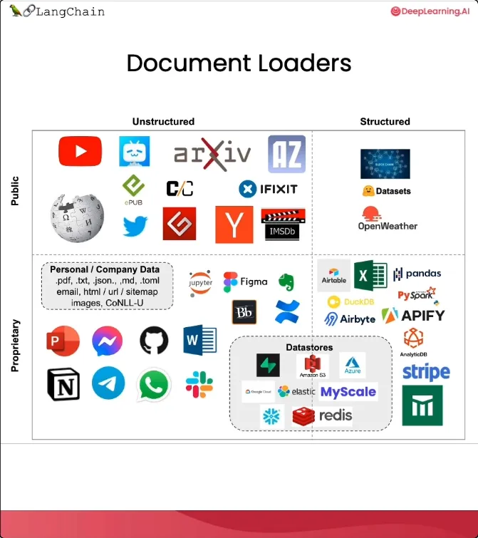

我们就可以通过langChain的方式将大量的文件放进来了。Loader就相当于是提前把文件放到一个容器里面，我们就可以基于这个容器对文件内部进行更改。

但是总的来说，Langchain是可以帮我们节省很多的整理文档的时间，我们常见的PDF、CSV、Word等等类型的文档都是能够直接导入的，甚至我们只需要给其Youtube视频链接就可以把整个视频的文本作为数据库然后来实现对话，这还是非常方便的一件事情。

下面我就用代码实战一下，以下是我用的关键库的版本，假如各位想要亲自实践的话务必按照以下版本，不然可能回出现报错情况！

```
langchain                0.3.0
langchain-community      0.3.0
pypdf                    5.0.0
openai                   1.47.0
beautifulsoup4           4.12.3
```

那首先假如我们需要将pdf载入，目前最新的版本已经不再是通过`from langchain.document_loaders import PyPDFLoader` 的方式，而是通过`from langchain_community.document_loaders import PyPDFLoader` 的方式实现。那完整的代码如下，我们就可以打印出文件内所有的内容和信息。

```python
from langchain_community.document_loaders import PyPDFLoader
loader = PyPDFLoader(r"D:\langchain\test1.pdf")
pages = loader.load()
print(pages)
```

其实本质上就是langchain调用了PyPDF这个库来实现了这个事情，类似的我们也可以对一些URL链接来转变为我们的Document。

```python
from langchain_community.document_loaders import WebBaseLoader
loader = WebBaseLoader("https://zh.d2l.ai/")
docs = loader.load()
print(docs[0].page_content[:500])
```

这个URL并非所有链接都可以实现爬虫抓取，这里我用的是李沐老师写的《动手学深度学习》的开源代码官网，这个官网没有使用太多反爬虫的技巧。但是国内很多其他的网页其实都使用了动态加载技术、需要用户登录，或是有特定的反爬虫机制。`WebBaseLoader` 主要用于抓取静态 HTML 内容，对于动态生成的内容（例如由 JavaScript 加载的内容），它无法直接处理。

除了PDF和URL以外，其实我们可以在Langchain在API官网上找到更多相关的信息。在下面图片右边都是一系列的Loader，包括Arxiv等等。但是我之前开发的时候就发现有些其实虽然写了但是用不了，还是得自己重新爬。又有一些其实是需要额外花费的，比如Google系列的很多可能初期是免费的，后期是需要额外花钱买key的额度的。

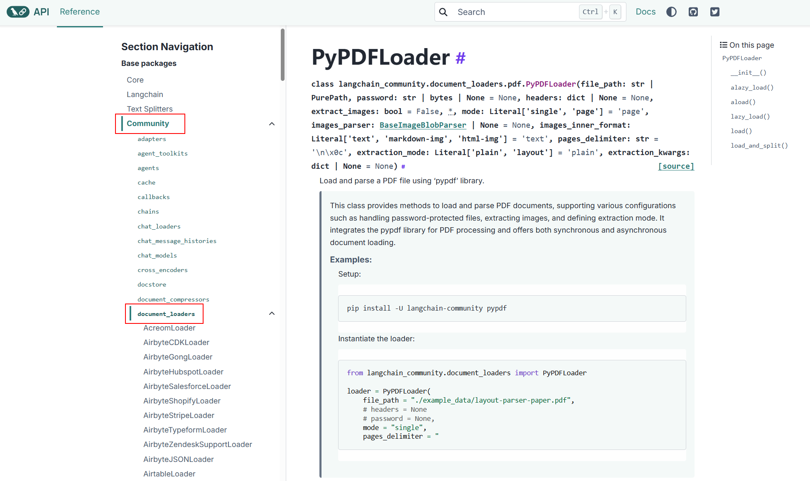


# 文档划分技术简介

当文档导入后，我们需要对文档的内容进行处理。大家应该都知道，对于检索增强生成（RAG）系统而言，最关键的是在系统中找到最合适的内容并输出。然而，由于大型语言模型的上下文容量有限，通常不可能将一个文档中的所有内容都输入进去。即便现在有些技术声称可以处理无限长度的内容，但从经济角度来看，更长的上下文意味着更高的计算成本和费用，因此并不划算。

解决这个问题的最佳方法之一是将文件进行切分，将其拆分成若干段。这样做有两大好处：

1. 通过 RAG 系统找到的内容在语义上的关联度更高，因此效果会更好。
2. 由于切分后的每段内容比整篇文章的字数少得多，所需的计算资源和费用也相应减少。这也是为什么自大型语言模型兴起以来，RAG 技术变得如此流行。

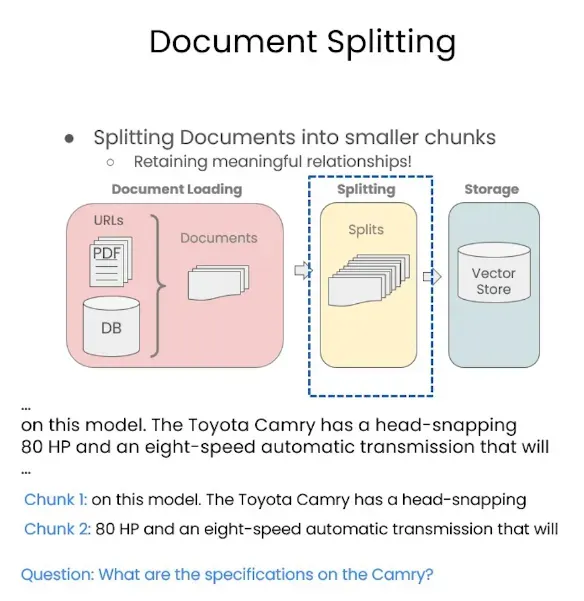

## **切分方法概述**

切分的方法有很多种，这里我们介绍一种最简单的方法——基于字数来切分。例如，`chunk_size` 表示每块内容的长度为 4000 个 token（字符），而 `chunk_overlap` 表示上下文重叠部分的长度为 200 个字符。之所以要有重叠部分，是因为每段文本之间都有一定的联系，并不是完全独立的。因此，获取重叠部分的内容相当于保留了一部分上下文信息，从而帮助大型语言模型更好地理解和处理这部分文本。

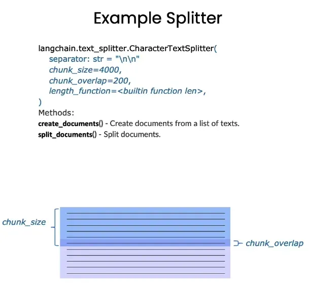

但是很显然，这样的办法并不是最好的方法。首先就是这种划分就是非常随机的，并不是真的按照语义的方式来进行划分的。其次就是这种上下文的获取也非常的生硬，因此其实很多时候我们会需要用到手工的方式去制作这样的chunk，通过个人的经验和想法找到比较合适的分块方式。那当然人手工的方式成本也非常高，因此langchain里除了最简单的文本分割以外还根据**语言**、**类型**的不同给出了更多的划分方式。

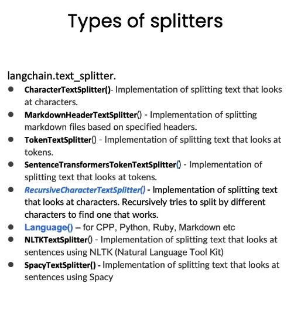

## **实例实践**

下面我们就来具体地实践一下LangChain其中的两种切分方法。具体的版本要求如下所示：

```
langchain                0.3.0
langchain-community      0.3.0
pypdf                    5.0.0
openai                   1.47.0
beautifulsoup4           4.12.3
```

我们首先可以通过一个简单的例子来观察文本切分的效果。首先，我们需要从 LangChain 的 `text_splitter` 模块导入两种常见的切分方式：`RecursiveCharacterTextSplitter` 和 `CharacterTextSplitter`。`CharacterTextSplitter` 是一种直接按照字符串长度进行划分的方法，正如前面图片中所展示的那样。

`RecursiveCharacterTextSplitter` 更加细致地分割文档，它不仅考虑分割后的文本长度，还会兼顾重叠字符。默认情况下，`RecursiveCharacterTextSplitter` 使用 `["\n\n", "\n", " ", ""]` 四种特殊符号作为分割文本的标记，并按照优先级顺序进行分割：首先尝试在双换行符（`\n\n`）处分割，然后是单换行符（`\n`），接着是空格（ ``），最后在无法找到合适分割点时强制进行分割。

因此，虽然使用 `RecursiveCharacterTextSplitter` 分割后的文本长度可能与设定的 `chunk_size` 不完全一致，但它会更倾向于按照句子或段落的形式来分割文本，从而保持更好的可读性和语义连贯性。

我们可以通过下面的例子来具体展示这两种分割方式的区别。首先，我们有一段文本 `some_text`。然后，我们配置好对应的 `c_splitter` 和 `r_splitter` 的参数，分别设置 `chunk_size` 为 450 且不设置 `chunk_overlap`。

```python
from langchain.text_splitter import RecursiveCharacterTextSplitter, CharacterTextSplitter
some_text = """When writing documents, writers will use document structure to group content. \
This can convey to the reader, which idea's are related. For example, closely related ideas \
are in sentances. Similar ideas are in paragraphs. Paragraphs form a document. \n\n  \
Paragraphs are often delimited with a carriage return or two carriage returns. \
Carriage returns are the "backslash n" you see embedded in this string. \
Sentences have a period at the end, but also, have a space.\
and words are separated by space."""

c_splitter = CharacterTextSplitter(
    chunk_size=450,
    chunk_overlap=0,
    separator = ' '
)
r_splitter = RecursiveCharacterTextSplitter(
    chunk_size=450,
    chunk_overlap=0, 
    separators=["\n\n", "\n", " ", ""])
```

然后我们就可以来调用`c_splitter`来看看运行后的结果：

```python
print(c_splitter.split_text(some_text))
```

然后我们可以在终端运行文件看到，这段文本被切分为了两块。但是很显然这两块的尺寸差距极大，这主要是因为这段文本本身只有496个字符串，那我们设置的`chunk_size`是450，对于`c_spliter`而言，其只考虑字符串的长度，因此将会把这部分文本分为450和46个字符串的两段文本。

```
['When writing documents, writers will use document structure to group content. This can convey to the reader, which idea\'s are related. For example, closely related ideas are in sentances. Similar ideas are in paragraphs. Paragraphs form a document. \n\n Paragraphs are often delimited with a carriage return or two carriage returns. Carriage returns are the "backslash n" you see embedded in this string. Sentences have a period at the end, but also,', 

'have a space.and words are separated by space.']
```

下面我们也一起来再加上一段代码打印一下`r_splitter`的结果。

```python
print(r_splitter.split_text(some_text))
```

我们会发现虽然对比起`c_spliter`的结果，`r_spliter`虽然字数上不满足要求，但是确实是按照句子的形式来划分的。划分的地点也是我们看到的第一优先级`\n\n`的位置。

```text
["When writing documents, writers will use document structure to group content. This can convey to the reader, which idea's are related. For example, closely related ideas are in sentances. Similar ideas are in paragraphs. Paragraphs form a document.", 

'Paragraphs are often delimited with a carriage return or two carriage returns. Carriage returns are the "backslash n" you see embedded in this string. Sentences have a period at the end, but also, have a space.and words are separated by space.']
```

**总结**

由此我们可以看出，对于自然语言处理的任务来说，一般情况下为了获取每个句子中更多的语义信息，我们通常会使用`RecursiveCharacterTextSplitter`的方式进行文本的分割。当然文本的分割其实还有很多能够调整的地方，比如说我们可以不仅仅用默认的`separators=["\n\n", "\n", " ", ""]` ，我们可以加入一些别的分割符号，比如`separators=["\n\n", "\n", "(?<=\. )", " ", ""]` ，并且根据文本的不同来进行调整。


# 向量数据库及嵌入

在前面的章节中，我们讲述了如何将文档进行导入以及将文档根据需要切分成不同的块。正常情况下，我们传统的数据库其实完全没有必要去将其切分成很多块，因为无论你怎么去切分都会导致一定的信息丢失。**而之所以我们需要将导入的内容进行切分，其实最主要的原因就是向量数据库的特性**。

- 首先，文档切分可以**提高查询的准确性**。通过将大块内容拆分成更小的内容块（chunks），这些块可以更精细地表达文档中的具体信息。对于向量数据库而言，这些小块可以更准确地进行向量化表示，从而在相似度搜索时，匹配到更加相关和精准的内容，提高查询结果的准确性。
- 其次，切分文档还可以**便于向量化处理**。当文档被切分为小块后，每个块的信息量更小，更适合向量化处理。向量化的过程需要对文本进行特征提取，而当文档过长时，特征提取的难度和复杂度会显著增加。而短文本能够更加有效地进行特征提取，从而使得最终生成的向量更具代表性。
- 另外，切分文档还可以**提升检索效率**。向量数据库中通常需要对大量数据进行相似度计算，切分后的小块可以减少每次计算的复杂度，从而提高检索效率。同时，通过切分，更容易将用户的查询需求与小块信息进行匹配，快速找到合适的内容。
- 最后，文档切分还可以实现**更好的信息覆盖**。长文档中可能包含多个主题或不同的信息点，直接将整个文档进行向量化处理可能会导致某些信息点被稀释或忽略。而通过切分，每个小块可以代表不同的主题或信息点，使得向量数据库中的信息覆盖更加全面，这样在进行查询时可以提供更丰富的响应。

**因此，在使用一定的技术对文本内容进行划分形成一个个的chunk（块）后，下一步我们就是要将这些内容存储起来了**。对于信息的管理而言，存储是至关重要的，因为假如信息不被存储起来，后续在我们需要时就无法顺利地调用出来。而将这些切分后的块存储到向量数据库中，也为后续的精准检索和高效利用奠定了坚实的基础。

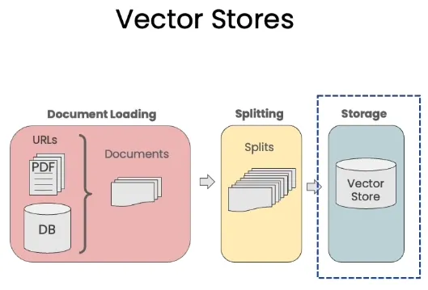

## **向量化处理**

**对于每一个经过切分的块，我们第一步就是要进行Embeddings（向量化）的工作。**Embeddings 的本质是将一段文本转化为一长串的向量，这些向量实际上是对文字的一种数字化表示。**换句话说，就是把文本内容翻译成机器可以理解和操作的数字形式。**当这些高维度的信息被映射到一个高维度的空间中时，我们会发现，如果两段话的语义相近，那么它们在这个高维度语义空间中的距离也会更接近。这种距离的相近性正是向量化的一个重要特征，它帮助我们在处理文本时，更容易捕捉到语义上的相似性。


## **构建向量数据库**

当所有的块都被转化为向量形式后，我们将这些向量统一放置在一个高维度的空间中，这样就搭建起了一个**向量数据库**。在这种数据库中，每个向量代表着一个文本块的语义特征。当用户输入一个问题时，这个问题也首先会被转化为一个向量，然后将该向量放入整个向量空间中，通过计算找到与这个向量距离最近的几个向量。这些距离最近的向量代表着与用户问题语义最相似的文本块。我们通过这些向量作为索引，找到对应的文本内容，然后将这些内容返回，作为大语言模型的输入。


## **提升大语言模型的回答质量**

**通过这种方式，大语言模型的回答不仅仅依赖于它自身预训练时所获取的知识，还可以结合向量数据库中存储的丰富外部信息。**因此，大语言模型在回答用户问题时，不仅更加专业化，而且更能紧密地贴合真实的使用场景和实际需求。结合了外部数据的支持，模型的回答显得更加灵活且充满上下文关联性，极大地提升了模型的实用性和回答的准确性。

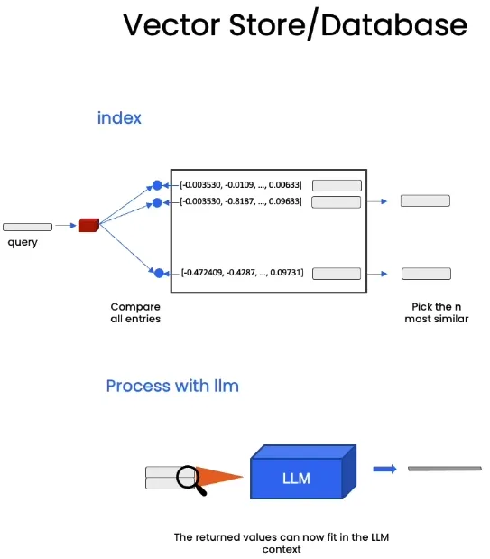

这种架构使得我们能够在处理各种复杂问题时，提供基于真实数据的动态响应，尤其是当信息需要不断更新或者有针对特定领域的高精度需求时，这种结合了向量数据库的方式显得尤为重要。通过将内部知识与外部数据库相结合，我们能够在更广泛的场景下提供更加高质量、个性化的响应。

## 代码演练

下面就让我们进入实战的环节来尝试一下如何实现文本向量化吧！主要包的环境版本如下所示：

```
langchain                0.3.0
langchain-community      0.3.0
pypdf                    5.0.0
openai                   1.47.0
beautifulsoup4           4.12.3
chromadb                 0.5.15
```

那首先在进行词向量嵌入前，我们还是需要先导入文件且进行切分。这里我们还是选择使用网页的内容，并且在最后打印一下切分的块数。

```python
from langchain_community.document_loaders import WebBaseLoader
from langchain.text_splitter import RecursiveCharacterTextSplitter

# 文件导入
loader = WebBaseLoader("https://zh.d2l.ai/")
docs = loader.load()

# 文本切分
text_splitter = RecursiveCharacterTextSplitter(
    chunk_size = 1500,
    chunk_overlap = 150
)
splits = text_splitter.split_documents(docs)
print(len(splits))
```


在运行后我们可以看到，基于我们的切分方式，这部分内容最后被切分为了18块，下面我们就需要选择一个合适的embedding模型来将这部分内容转化为数字的表达并存储在向量空间之中。对于langchain而言，支持程度最高的当属OpenAI的embedding模型，但是由于我们国内的网络无法直接使用OpenAI的服务，因此我们需要前往Langchain的官网查看其他可用的embedding模型。

这里我们选择zhipu


```python
# https://python.langchain.com/api_reference/community/embeddings/langchain_community.embeddings.zhipuai.ZhipuAIEmbeddings.html#langchain_community.embeddings.zhipuai.ZhipuAIEmbeddings

from langchain_community.embeddings import ZhipuAIEmbeddings

embed = ZhipuAIEmbeddings(
    model="embedding-2",
    api_key="...",
)
input_text = "The meaning of life is 42"
embed.embed_query(input_text)[:10]

# input_texts = ["This is a test query1.", "This is a test query2."]
# embed.embed_documents(input_texts)
```


假如在运行后成功显示了这一串数字的列表就意味着我们成功配置好了模型。

```
[-0.003832892,
 0.049372625,
 -0.035413884,
 -0.019301128,
 0.002336027,
 0.0011216394,
 -0.04054263,
 -0.020642027,
 0.0068899863,
 -0.012894258]
```

在准备好了embedding模型后，我们还需要解决的一个问题是用哪一个向量数据库进行向量的存储。在Langchain的官方文档中我们可以看到，Langchain最常支持的有四个向量数据库，包括Chroma、Pinecone、FAISS以及Lance。那这里我就以Chroma为例来展示一下具体的使用方式：


### Chroma数据库为例

我们先跟着官方文档的要求安装一下Chorma这个库。

```shell
pip install -qU chromadb langchain-chroma
```

安装完成后，我们就可以开始设置一下我们向量数据库存放的位置然后进行设置了。

```shell
# https://python.langchain.com/api_reference/chroma/vectorstores/langchain_chroma.vectorstores.Chroma.html#langchain_chroma.vectorstores.Chroma

from langchain_chroma import Chroma
# 存放文件路径设置
persist_directory = r'./langchain-chroma'

# 创建向量数据库
vectordb = Chroma.from_documents(
    documents=splits,
    embedding=embeddings,
    persist_directory=persist_directory
)
print(vectordb._collection.count())
```

最后假如也是打印出18的话就代表向量数据库创建完成。此时我们就可以在存放的路径处找到一个名为chorma.sqlite3的文件以及一个存放了内容的文件夹。这个就是我们所设置的向量数据库了。

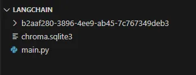


我们可以尝试对我们建立的数据库进行内容的检索，看看能不能找到最相关的块。

```
# 检索
question = "图像识别"
docs = vectordb.similarity_search(question,k=3)
print(len(docs))
print(docs[0].page_content)
```

我们发现其找到的内容里就包括了计算机视觉的相关内容，因此其实是成功的找到比较相关的内容的！

```text
13. 计算机视觉
13.1. 图像增广
13.2. 微调
13.3. 目标检测和边界框
13.4. 锚框
13.5. 多尺度目标检测
13.6. 目标检测数据集
13.7. 单发多框检测（SSD）
13.8. 区域卷积神经网络（R-CNN）系列
13.9. 语义分割和数据集
13.10. 转置卷积
13.11. 全卷积网络
13.12. 风格迁移
13.13. 实战 Kaggle 比赛：图像分类 (CIFAR-10)
13.14. 实战Kaggle比赛：狗的品种识别（ImageNet Dogs）
```

**完整的代码如下所示：**

```python
from langchain_community.document_loaders import WebBaseLoader
from langchain.text_splitter import RecursiveCharacterTextSplitter
from langchain_community.embeddings import ZhipuAIEmbeddings
from langchain_chroma import Chroma
# 文件导入
loader = WebBaseLoader("https://zh.d2l.ai/")
docs = loader.load()

# 文本切分
text_splitter = RecursiveCharacterTextSplitter(
    chunk_size = 1500,
    chunk_overlap = 150
)
splits = text_splitter.split_documents(docs)
print(len(splits))

# 文本嵌入
embeddings = BaichuanTextEmbeddings(baichuan_api_key="sk-83842453061e34d80b392edba11f62fe")
embed = ZhipuAIEmbeddings(
    model="embedding-2",
    api_key="5713143e8fdc4b4a8b284cf97092e70f.qEK71mGIlavzO1Io",
)

# 测试
# text_1 = "今天天气不错"

# query_result = embeddings.embed_query(text_1)
# print(query_result)

# 路径设置
persist_directory = './langchain-chroma'

# 向量库创建
vectordb = Chroma.from_documents(
    documents=splits,
    embedding=embeddings,
    persist_directory=persist_directory
)
print(vectordb._collection.count())

# 检索
question = "图像识别"
docs = vectordb.similarity_search(question,k=3)
print(len(docs))
print(docs[0].page_content)
```

**结语**

以上就是本节课的主要内容！**我们探讨了向量数据库（VectorStore）和嵌入（Embedding）的概念，并通过 Langchain 和ZHIPU API 的结合，成功实现了向量数据库的创建。**这使得我们能够在高效管理语义信息的基础上，为后续的大模型对话系统提供强有力的支持。

在之后的课程中，我们将逐步探索如何将这些构建好的向量数据库与大语言模型结合起来，实现更高效的**信息检索（Retrieval）**。这将帮助模型能够从海量信息中快速找到最相关的内容，提供精准且有上下文关联的回答，让整个对话体验更加智能和自然。


# 向量数据库中的检索优化

在前面的课程中，我们已经介绍了关于文本数据如何被载入并进行切分，以及如何将这部分切分后的文本数据进行向量化后存储在我们的向量数据库当中。完成了以上的步骤其实就是意味着我们前期数据处理工作已经完成了，即便是我们需要载入更多的数据存储到向量数据库中，我们只需要重复上述的步骤即可。在上节课的末尾，我们简单尝试了一下在向量数据库中通过similarity_search的方式进行相关数据的检索，那这节课我们来更加深入的阐述一下这部分的内容。

那对于Retrival这个事情而言，除了最基本的**similarity_search**通过计算计算查询向量和所有候选文档向量之间的相似度以外，我们其实还有一些其他的方法，包括**Maximum Marginal Relevance**（MMR，最大边际相关性）、**Metadata**（元数据）以及**LLM Aided Retrieval**（大型语言模型辅助检索）等。那下面我们将逐一介绍一下这些方法。

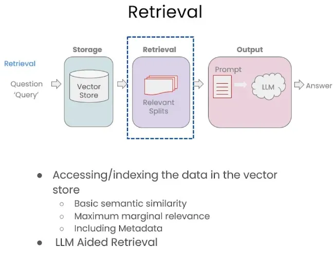

## **Similarity Search 方法详解**

**Similarity Search（相似度搜索）** 是向量数据库中最基础的检索方法之一。它通过计算查询向量与数据库中所有文档向量之间的相似度，来找到与查询最相关的文档。通常使用的相似度度量方法包括 **余弦相似度**、**欧氏距离** 等，这些方法能够有效衡量两个向量在高维空间中的接近程度。

在相似度搜索中，用户输入一个查询，系统会将这个查询转化为一个向量，然后与数据库中的向量进行比较，从而找到最相似的内容。这种方法的优点在于它的简单和直观，适合用于快速找到与查询内容高度相关的结果。例如，当用户查询“深度学习的基本概念”时，相似度搜索能够返回与“深度学习”内容最接近的文档片段。

相似度搜索提供了直接匹配用户查询的能力，是许多向量数据库的基础检索方式。然而，***单纯依赖相似度搜索可能导致结果的多样性不足，因为它仅关注与查询的匹配程度，而忽略了内容之间的差异性***。在一些应用场景下，特别是需要覆盖多个不同方面的信息时，**Maximum Marginal Relevance (MMR)** 这样的扩展方法可以更好地平衡相关性和多样性。

## **Maximum Marginal Relevance 方法详解**

在信息检索和自然语言处理领域，检索最相似的信息并非总是最优的选择，特别是在用户需求涵盖多个不同方面时，仅选择与查询最相似的响应可能会造成信息重复，缺乏多样性。为了解决这一问题，**Maximum Marginal Relevance (MMR)** 方法应运而生。MMR 通过在相关性和多样性之间进行权衡，从而优化最终检索结果，使用户能够获得既相关又互补的信息。

### **MMR 方法的原理与动机**

如图所示，当用户提出查询（例如"Tell me about all-white mushrooms with large fruiting bodies"）时，系统会尝试寻找与查询最相似的响应。然而，完全基于相关性的检索可能会忽略信息的多样性。例如，***如果只选择最相似的响应，得到的结果可能会非常相似，甚至包含重复的内容***。这时，虽然每个结果与查询的相似度都很高，但它们却未能提供全面且多样化的内容。

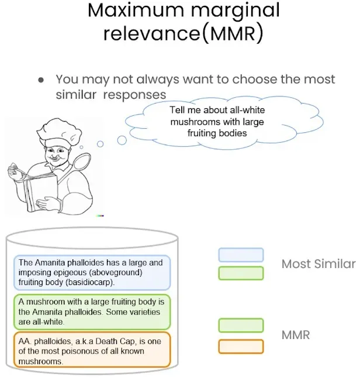

MMR 的核心思想是**平衡相关性与多样性**，即在选择与查询最相关的信息的同时，也要确保这些信息在内容上具有多样性。通过减少信息之间的重复性，MMR 能够帮助用户获得更加全面和丰富的知识视角，涵盖不同的细节和角度，而不仅仅是获取多个相似的答案。例如，在检索某一特定主题的文档时，MMR 不仅会选出与查询高度匹配的结果，还会确保所选文档在涵盖的内容和信息层次上存在差异，从而使得用户得到的结果既有深度又有广度。

### **MMR 算法的工作流程**

MMR 算法的具体工作流程可以通过下图来理解，下面逐步分解介绍其主要步骤：

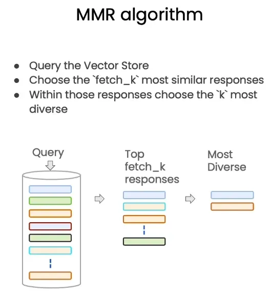

1. **查询向量存储（Query the Vector Store）**
   - 首先，将用户的查询转换为向量，并在向量存储库中进行匹配。在向量存储中，每个文档或片段都表示为一个向量，这些向量通常是通过嵌入模型（如 OpenAI Embedding）进行计算的。
2. **选择最相似的响应（Choose the `fetch_k` most similar responses）**
   - 接下来，从向量存储中检索出与查询最相似的前 `k` 个响应（这些响应的相似性是基于余弦相似度等度量方法计算的）。这部分的结果确保了选出的内容是对查询最有意义、最相关的。
3. **在相似响应中选择最具多样性的结果（Within those responses choose the `k` most diverse）**
   - 在初步选出的 `k` 个最相似响应中，MMR 方法会进一步选择出 `k` 个最具多样性的响应。通过计算每对响应之间的相似度，MMR 会偏好那些彼此差异较大的结果，以增加信息的覆盖面。这一过程确保了返回的结果不仅仅是“最相似”，更是“互补的”。

MMR 的关键在于它通过一个权重参数（通常表示为 λ）来实现对相关性和多样性的平衡。当 λ 趋向于 1 时，MMR 更偏重选择与查询最相似的响应；而当 λ 接近于 0 时，MMR 更倾向于增加检索结果的多样性。通过调节这一权重，MMR 能够适应不同的检索场景。

- **相关性（Similarity）** ：确保检索出的文档与用户查询之间有很高的语义相似性，能够直接回答用户的问题。
- **多样性（Diversity）** ：避免信息之间的冗余，使得每个返回的结果都包含新的、有用的内容。

### **MMR 的实际应用**

MMR 方法在许多信息检索和推荐系统中得到了广泛应用。它在解决那些**信息覆盖面广泛**的问题上尤为有效，特别是用户的需求涉及多个不同方面时。比如在搜索与某一主题相关的文档时，MMR 可以帮助系统同时返回一些具体细节的内容，以及一些覆盖整个主题的概述性文档，从而让用户对所查询的主题有更完整的理解。但其实究其本质还是基于similarity_search的方法，但是就像大语言模型一样需要调整一下temperature的值使其随机性更高，更符合人类日常说话的状态。因为说话永远没有所谓的最优解，我们都会有一些灵光一闪的时候。

## **利用元数据提高检索精确度：基于自查询检索器的方法**

在信息检索过程中，如何提高检索的精度，特别是在面对大量、复杂的文档时，是一个非常重要的问题。在前面我们提到向量数据库中的`similarity_search`以及`Maximum Marginal Relevance`可以帮助我们找到与查询内容最相似的文档，但有时，仅依靠相似度还不够精确，尤其当用户的查询具有非常明确的限定条件时。为了解决这种情况，我们可以借助**元数据（Metadata）**来进一步提高检索的准确性。

元数据提供了与每个嵌入的文本片段相关的上下文信息，这些信息可以用来更好地限定检索的范围。例如，***当用户询问特定课程的内容时，我们不希望返回其他课程的结果***。为此，许多向量数据库都支持在检索时对元数据进行操作，这使得检索变得更加准确。

以如下查询为例：

**问题："第三讲中提到回归分析的内容是什么？"**

在这个问题中，用户明确希望得到第三讲的内容。因此，如果我们不对查询进行任何过滤，那么可能会得到来自其他讲次的相关内容。为了解决这一问题，我们可以利用元数据中的信息，在`similarity_search`时加入过滤条件，例如指定源文件为"docs/cs229_lectures/MachineLearning-Lecture03.pdf"，确保只从特定的文档中进行检索。这样做就能精确地找到用户想要的内容，而不会被其他不相关的讲次干扰。

元数据的使用不仅限于来源文档的过滤，还可以包括诸如页码、作者、时间戳等各种信息，这些信息都可以在检索时作为过滤条件，提高查询的精确性。

## **实战演练**

下面就让我们进入实战的环节来尝试一下如何实现向量数据库检索吧！主要包的环境版本如下所示：

```
langchain                0.3.0
langchain-community      0.3.0
pypdf                    5.0.0
openai                   1.47.0
beautifulsoup4           4.12.3
chromadb                 0.5.15
```

首先我们要先运行一下上一期内容“[吴恩达DeepLearning.AI课程系列 —— 大模型检索增强生成（三）：向量数据库及嵌入](https://mp.weixin.qq.com/s?__biz=Mzg2NzU4MDgzMA==&mid=2247525242&idx=1&sn=0501c26bb1f9c9b05e998091497c724e&scene=21#wechat_redirect)”的代码，从而在指定的位置生成出相关的Chroma数据库后我们才能开始本次的操作。只要看到该文件生成即代表数据库创建完毕。

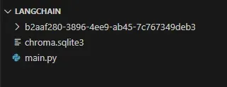

下面我们新建一个名为retrieval.py的文件来将测试数据库是否正确生成的代码写入并查看。假如能够正常打印出数值则代表没有问题。

```python
from langchain_community.embeddings import BaichuanTextEmbeddings
from langchain_chroma import Chroma  # 从 langchain_chroma 中引用 Chroma 类

persist_directory = './langchain'

# 初始化嵌入
embeddings = BaichuanTextEmbeddings(baichuan_api_key="sk-xxx") # 查看上期内容并填入对应的百川API Key

# 使用 embedding_function 参数初始化 Chroma
vectordb = Chroma(
    persist_directory=persist_directory,
    embedding_function=embeddings
)

# 打印集合中的文档数量
print(vectordb._collection.count())
```

### **Similarity Search（相似度搜索）**

那我们首先可以尝试一下最基础的方法，就是我们的Similarity Search。我们可以在上面代码的基础上添加以下内容。我们问一下大语言模型是怎么样推理的来从网页里（尤其是目录）中找到对应的内容。

```python
# 定义问题，即要查询的内容
question = "大语言模型是怎么推理的？"

# 在向量数据库中进行相似性搜索，查找与给定问题最相似的 3 个文档
docs_ss = vectordb.similarity_search(question, k=2)

# 输出最相似的文档中前 100 个字符的内容
print(docs_ss[0].page_content[:100])
print(docs_ss[1].page_content[:100])
```

我们在终端的结果中可以看到输出的内容。这部分内容确实与推理息息相关。

```
# 第一部分
9. 现代循环神经网络
9.1. 门控循环单元（GRU）
9.2. 长短期记忆网络（LSTM）
9.3. 深度循环神经网络
9.4. 双向循环神经网络
9.5. 机器翻译与数据集
9.6. 编码器-解

# 第二部分
10. 注意力机制
10.1. 注意力提示
10.2. 注意力汇聚：Nadaraya-Watson 核回归
10.3. 注意力评分函数
10.4. Bahdanau 注意力
10.5. 多头注意力
```

### **Maximum Marginal Relevance (MMR)**

我们也可以尝试一下使用MMR的方法进行检索看是否效果更好。

```python
# 定义问题，即要查询的内容
question = "大语言模型是怎么推理的？"
docs_mmr = vectordb.max_marginal_relevance_search(question,k=2)
print(docs_mmr[0].page_content[:100])
print(docs_mmr[1].page_content[:100])
```

我们发现输出的内容有些许的问题。首先是终端先显示了一个警告说默认的返回内容为20个，比我们数据库里包含的18个内容要多。然后我们发现虽然第一部分内容是一致的，而这个第二部分的内容和之前有点不同，但是显然这部分内容的相近程度没有上面直接使用Similarity Search的接近。***从这里我们也可以看出添加了随机性后模型的效果未必会好***。

```
# 警告内容
Number of requested results 20 is greater than number of elements in index 18, 
updating n_results = 18

# 第一部分内容
9. 现代循环神经网络
9.1. 门控循环单元（GRU）
9.2. 长短期记忆网络（LSTM）
9.3. 深度循环神经网络
9.4. 双向循环神经网络
9.5. 机器翻译与数据集
9.6. 编码器-解

# 第二部分内容
Vardhman Mahaveer Open University     
      Vietnamese-German University    
      Vignana Jyothi Institute        
```

为了消除警告内容，我们就需要添加一个额外的参数`fetch_k = 8`。这个参数指在进行 **最大边际相关性** 搜索时，初始化从数据库中提取的 **候选文档数量**。也就是说，在做最终选择之前，`docs_mmr`会从数据库中取出与 `question` 最相似的 8 个文档，然后从这些候选文档中选出 `k=2` 个文档，来最大化它们之间的多样性。

```python
docs_mmr = vectordb.max_marginal_relevance_search(question,k=2, fetch_k=8)
print(docs_mmr[0].page_content[:100])
print(docs_mmr[1].page_content[:100])
```

当我们再次运行程序时，警告就消失了。

```
9. 现代循环神经网络
9.1. 门控循环单元（GRU）
9.2. 长短期记忆网络（LSTM）
9.3. 深度循环神经网络
9.4. 双向循环神经网络
9.5. 机器翻译与数据集
9.6. 编码器-解
Vardhman Mahaveer Open University     
      Vietnamese-German University    
      Vignana Jyothi Institute  
```

当然其实我们也可以通过调整`fetch_k`的值来控制随机答案的生成，比如我们可以尝试`fetch = 2`和`fetch = 3`。首先我们试试`fetch_k=2`的情况。

```python
docs_mmr = vectordb.max_marginal_relevance_search(question,k=2, fetch_k=2)
print(docs_mmr[0].page_content[:100])
print(docs_mmr[1].page_content[:100])
```

所得的结果和前面Similarity Search是一模一样的。这是因为我们就从里面找到两个概率最高的内容，然后k=2的情况就把所有这两个都拿过来了，并没有能够随机的地方。

```text
9. 现代循环神经网络
9.1. 门控循环单元（GRU）
9.2. 长短期记忆网络（LSTM）
9.3. 深度循环神经网络
9.4. 双向循环神经网络
9.5. 机器翻译与数据集
9.6. 编码器-解

10. 注意力机制
10.1. 注意力提示
10.2. 注意力汇聚：Nadaraya-Watson 核回归
10.3. 注意力评分函数
10.4. Bahdanau 注意力
10.5. 多头注意力
```


假如fetch = 3时。

```
docs_mmr = vectordb.max_marginal_relevance_search(question,k=2, fetch_k=3)
print(docs_mmr[0].page_content[:100])
print(docs_mmr[1].page_content[:100])
```

所得的结果就有所不同，这个时候由于找到另外一块内容，为了满足随机的要求，因此就必然会将这部分内容进行展示。

```
9. 现代循环神经网络
9.1. 门控循环单元（GRU）
9.2. 长短期记忆网络（LSTM）
9.3. 深度循环神经网络
9.4. 双向循环神经网络
9.5. 机器翻译与数据集
9.6. 编码器-解
参考文献
Table Of Contents

前言
安装
符号

1. 引言
2. 预备知识
2.1. 数据操作
2.2. 数据预处理
2.3. 线性代数
2.4.
```

所以我们可以看到在方法MMR中我们可以根据各种参数来对其进行调整从而能够输出更随机更多样的内容。

### **元数据（Metadata）**

更进一步，我们也可以用检索特定元数据来进行更精确的搜索。我们可以先查查看我们的内容有哪些可能的元数据。

```python
# 假设你有一个 vectordb 对象，并且可以获取所有文档
all_docs = vectordb.similarity_search("", k=18)  # 可以使用一个空查询或任意查询返回多个文档

# 遍历文档并输出每个文档的元数据
for i, doc in enumerate(all_docs):
    print(f"Document {i+1} metadata: {doc.metadata}")
```

我们可以在终端里看到，由于我们都是在一个链接里进行搜索的，所以所有的元数据都是一样的。

```python
"metadata": {
    "source": "<https://zh.d2l.ai/>",
    "language": "en",
    "title": "《动手学深度学习》 — 动手学深度学习 2.0.0 documentation",
}
```

那这个时候其实我们也可以尝试添加一些新的内容进去，大家可以在上期代码的基础上加上以下的代码（在运行前可以将原本数据库删除，不然会一直添加）。

```python
# 添加新文档
new_loader = WebBaseLoader("https://www.deeplearning.ai/")  # 新文档来源
new_docs = new_loader.load()

# 文本切分
new_splits = text_splitter.split_documents(new_docs)

# 添加到现有的向量库
vectordb.add_documents(new_splits)

# 输出更新后的文档数量
print(f"更新后的文档数量: {vectordb._collection.count()}")
```

运行后我们可以看到的结果为新的网址提供了额外了两份内容。

```
初始文档数量: 18
更新后的文档数量: 20
```

这个时候我们再查看里面的元数据会发现有额外两条新的内容。

```
Document 8 metadata: {'description': 'DeepLearning.AI | Andrew Ng | Join over 7 million people learning how to use and build AI through our online courses. Earn certifications, level up your skills, and stay ahead of the industry.', 'language': 'en', 'source': '<https://www.deeplearning.ai/>', 'title': 'DeepLearning.AI: Start or Advance Your Career in AI'}
Document 18 metadata: {'description': 'DeepLearning.AI | Andrew Ng | Join over 7 million people learning how to use and build AI through our online courses. Earn certifications, level up your skills, and stay ahead of the industry.', 'language': 'en', 'source': '<https://www.deeplearning.ai/>', 'title': 'DeepLearning.AI: Start or Advance Your Career in AI'}
```

这时候我们可以通过文章来源尝试一下在similarity searchsh上假如元数据的搜索。

```
question = "大语言模型是怎么推理的？"
docs_meta = vectordb.similarity_search(question, k=1, filter={"source": "<https://www.deeplearning.ai/>"})
print(docs_meta[0].page_content[:100])
```

这个时候我们发现结果就只会出现DeepLearning.AI网页里的内容了。

```
prevnextIn Collaboration WithprevnextThe largest weekly AI newsletterWhat matters in AI right nowOct
```

### **本门课完整代码展示**

前期准备

```python
from langchain_community.document_loaders import WebBaseLoader
from langchain.text_splitter import RecursiveCharacterTextSplitter
from langchain_community.embeddings import BaichuanTextEmbeddings
from langchain_chroma import Chroma
# 文件导入
loader = WebBaseLoader("<https://zh.d2l.ai/>")
docs = loader.load()

# 文本切分
text_splitter = RecursiveCharacterTextSplitter(
    chunk_size = 1500,
    chunk_overlap = 150
)
splits = text_splitter.split_documents(docs)
print(len(splits))

# 文本嵌入
embeddings = BaichuanTextEmbeddings(baichuan_api_key="sk-83842453061e34d80b392edba11f62fe")

# 测试
# text_1 = "今天天气不错"

# query_result = embeddings.embed_query(text_1)
# print(query_result)

# 路径设置
persist_directory = './langchain-chroma'

# 向量库创建
vectordb = Chroma.from_documents(
    documents=splits,
    embedding=embeddings,
    persist_directory=persist_directory
)
print(vectordb._collection.count())

# # 检索
# question = "图像识别"
# docs = vectordb.similarity_search(question,k=3)
# print(len(docs))
# print(docs[0].page_content)

# 添加新文档
new_loader = WebBaseLoader("https://www.deeplearning.ai/")  # 新文档来源
new_docs = new_loader.load()

# 文本切分
new_splits = text_splitter.split_documents(new_docs)

# 添加到现有的向量库
vectordb.add_documents(new_splits)

# 输出更新后的文档数量
print(f"更新后的文档数量: {vectordb._collection.count()}")
```

检索方法

```python
from langchain_community.embeddings import BaichuanTextEmbeddings
from langchain_chroma import Chroma  # 从 langchain_chroma 中引用 Chroma 类

persist_directory = r'D:\langchain'

# 初始化嵌入
embeddings = BaichuanTextEmbeddings(baichuan_api_key="sk-83842453061e34d80b392edba11f62fe")

# 使用 embedding_function 参数初始化 Chroma
vectordb = Chroma(
    persist_directory=persist_directory,
    embedding_function=embeddings
)

# 打印集合中的文档数量
# print(vectordb._collection.count())

# question = "大语言模型是怎么推理的？"
# docs_ss = vectordb.similarity_search(question,k=2)
# print(docs_ss[0].page_content[:100])
# print(docs_ss[1].page_content[:100])

# docs_mmr = vectordb.max_marginal_relevance_search(question,k=2, fetch_k=3)
# print(docs_mmr[0].page_content[:100])
# print(docs_mmr[1].page_content[:100])

# 假设你有一个 vectordb 对象，并且可以获取所有文档
# all_docs = vectordb.similarity_search("", k=20)  # 可以使用一个空查询或任意查询返回多个文档

# # 遍历文档并输出每个文档的元数据
# for i, doc in enumerate(all_docs):
#     print(f"Document {i+1} metadata: {doc.metadata}")

question = "大语言模型是怎么推理的？"
docs_meta = vectordb.similarity_search(question, k=1, filter={"source": "https://www.deeplearning.ai/"})
print(docs_meta[0].page_content[:100])
```

**总结**

总的来说，在这篇文章中，我们深入探讨了如何在向量数据库中进行更加精准的检索，从基础的相似度搜索到更高级的检索方法，例如 **Maximum Marginal Relevance (MMR)** 和 **元数据辅助检索**，并结合了 **大型语言模型（LLM）** 来提高检索的智能化水平。相似度搜索为我们提供了最直接的查询匹配，而 MMR 方法在相关性和多样性之间找到了平衡，使检索结果更全面。在元数据辅助检索中，我们可以利用元数据过滤条件进行精确搜索，避免无关内容的干扰。

下一节课我们将会讲述一下 **自查询检索器（SelfQueryRetriever）、大语言模型辅助检索（LLM Aided Retrieval ）** 和 **Compression（压缩）** 的内容。这些方法的结合使得检索系统能够更好地理解用户需求，并提供符合用户期望的高质量答案。

# 检索优化进阶

在上一节中，我们探讨了几种信息检索方法，包括 **Similarity Search（相似度搜索）** 和 **Maximum** **Marginal** **Relevance** **(MMR)**，还介绍了如何利用 **元数据（Metadata）** 提高检索精度。这些方法帮助我们理解如何在向量数据库中进行高效的检索，既保证结果的相关性，又兼顾多样性。

这节课我们继续深入信息检索的世界，介绍三种更高级的工具：**自查询检索器（SelfQueryRetriever）**、**大型语言模型辅助检索（LLM Aided Retrieval）** 和 **压缩（Compression）**。

- **自查询检索器** 可以自动从用户的自然语言查询中生成元数据过滤条件，让检索过程更加精准和高效。
- **大型语言模型辅助检索** 利用大型语言模型的理解能力，将复杂查询转化为有效的检索策略，进一步提高检索结果的精确性。
- **压缩** 则帮助我们从冗余的原始信息中提取出最有价值的部分，使得在有限的上下文中包含更多有用内容，提升生成质量。

那下面就让我们开始更深入的学习吧。

## 自查询检索器（SelfQueryRetriever）

虽然在上节课我们通过元数据的方式提升了检索的精度。但是，在实际的应用中，我们面临一个有趣的挑战：元数据过滤条件往往需要我们从查询中推断出来，也就是说，我们需要根据用户的查询来自动决定应该应用哪些元数据过滤条件。这时就需要用到一种叫做**自查询检索器（SelfQueryRetriever）**的方法，即利用大型语言模型（LLM）从查询本身中提取信息的工具。这些信息包括：

1. **用于向量检索的查询字符串**：也就是用户实际的查询内容。
2. **用于向量检索的元数据过滤条件**：例如，应该从哪个文档中检索，是否有特定的页码等。

这种方法的优势在于，用户无需明确地指出元数据的过滤条件。**SelfQueryRetriever**可以根据用户的自然语言查询自动推断出这些条件。例如，当用户询问"第三讲的回归分析"时，系统可以自动判断出用户只对第三讲的内容感兴趣，从而为检索过程加上相应的元数据过滤条件。

自查询检索器依赖于大型语言模型（例如GPT-4o）来解析用户的查询。在这一过程中，模型会先对查询进行理解，然后根据查询的内容生成适当的元数据过滤条件，并将这些条件与原始查询结合，传递给向量数据库进行检索。

例如，在前述的例子中，**SelfQueryRetriever**会分析查询中的关键词"第三讲"和"回归分析"，然后生成一个适用于向量检索的元数据过滤条件：

- **source**：指向特定的讲次文档，例如"docs/cs229_lectures/MachineLearning-Lecture03.pdf"。
- **page**：如果用户提到了具体的页码，检索器也可以根据上下文自动提取出来。

这种方式的好处显而易见：它可以帮助用户在无需了解具体技术细节的情况下，自动得到最相关的检索结果。这种方法特别适用于那些查询意图明确，但并不一定使用技术语言来描述的用户场景。

通过结合向量检索与元数据过滤，**SelfQueryRetriever**可以最大程度地实现对用户查询的精确理解和对检索结果的精准控制，从而为用户提供更加符合需求的答案。这种方式使得整个检索过程不仅能够理解语义，还能充分利用上下文中的各种信息，大大提升了用户体验。

总结来说，利用元数据以及**SelfQueryRetriever**，我们能够更加有效地处理那些对检索内容有明确限定的查询。在实际应用中，这意味着我们可以显著减少无关内容的干扰，为用户提供更加精准的答案，从而提高检索的质量和用户的满意度。

## 大型语言模型辅助检索(LLM Aided Retrieval)

在检索领域中，除了传统的相似度检索和最大边际相关性（MMR）之外，**大型语言模型（LLM）辅助检索**也是一种强有力的工具，能够进一步提升检索的智能化水平。LLM Aided Retrieval 的优势在于它能够理解自然语言查询的深层语义，并将这些语义信息转换为复杂的检索表达式，使得查询变得更具针对性和有效性。

### 为什么我们需要 LLM Aided Retrieval ？

传统的相似度检索方法，虽然在大多数情况下能够找到与用户查询最为相关的内容，但在面对复杂的查询时，效果往往受到限制。例如，当用户提出的查询包含多个层次或需要结合上下文信息来理解时，简单地将查询向量化再进行相似度匹配，可能会导致精度下降。这时候就需要利用大型语言模型的强大能力来辅助检索，**理解查询背后的意图，并生成更为有效的检索策略**。

例如，用户可能会询问 "1980年有哪些关于外星人的电影？"，这个问题不仅包含了具体的主题 "外星人"，还包含了时间限制 "1980年"。通过 LLM 的辅助，我们可以将这个查询解析为两个部分：**过滤条件（filter）和检索主题（search term）**。这样，过滤条件可以用于筛选数据集中的特定年份，而检索主题则用于匹配相关内容，提升整体检索的精准度和有效性。

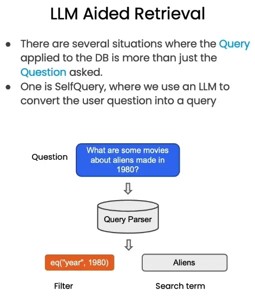

### LLM Aided Retrieval 的工作流程

LLM Aided Retrieval 的核心是通过大型语言模型来解析用户的自然语言查询，将其转换为结构化的查询，结合向量检索或传统的关键字检索方法来提高检索效果。以下是其基本的工作流程：

1. **用户查询解析**
   - 用户输入一个自然语言查询，如 "有哪些外星人电影是1980年制作的？"。
   - LLM 会解析这个查询，提取出其中包含的意图、约束条件和主题关键词。
2. **生成结构化查询**
   - 在解析查询后，LLM 将生成一个结构化的查询表达式。例如，将 "1980年" 作为一个**过滤条件**，而 "外星人电影" 作为一个**检索关键词**。
   - 这个结构化查询表达式可以是一个 SQL 查询、API 查询参数，或者是向量检索时的元数据过滤条件。
3. **结合元数据进行查询执行**
   - 在执行查询时，可以结合元数据进行过滤，例如来源文档、时间戳、页码等。通过在检索时应用这些元数据，可以进一步提高检索的精度。例如，当用户的查询中包含特定的来源或时间限制时，可以利用这些元数据过滤掉不相关的内容。
   - 将生成的结构化查询传递给底层的数据库或者向量存储进行检索。
   - 通过对查询条件的严格匹配和对向量空间中相似内容的查找，系统返回与用户查询最为相关的结果。

虽然 **SelfQueryRetriever** 和 **LLM Aided Retrieval** 都利用了大型语言模型来解析和理解用户的查询，提高检索的精准度，但两者在应用范围、处理复杂度和实现方式上有所不同。**SelfQueryRetriever** 更侧重于在向量检索中自动提取元数据过滤条件，适用于较为直接的查询。而 **LLM Aided Retrieval** 则是一个更广泛的框架，利用 LLM 的强大理解和生成能力，处理复杂的查询，生成更有效的检索策略，可能涉及多种检索技术的融合。

总的来说，LLM Aided Retrieval 为信息检索带来了新的可能性，特别是在处理复杂、模糊的用户查询时，能够显著提升检索的精度和用户的满意度。然而，在实际应用中，如何权衡计算资源的开销与检索质量，如何处理 LLM 可能带来的误判，仍然是我们需要进一步探索的问题。

## 压缩方法（Compression）

在信息检索的过程中，我们经常会遇到一个现实的问题：在面对海量的候选数据时，如何在有限的上下文空间中放入尽可能多的有用信息？特别是当我们需要处理的大型语言模型（LLM）的上下文长度有限时，比如llama2模型的上下文长度就只有4096，如何从原始信息中提取出最具价值的部分显得尤为关键。为了解决这一挑战，**Compression（压缩）** 方法应运而生。

### Compression 方法的动机与作用

在用户提出问题时，系统会从存储中检索出一系列与查询相关的文本片段，这些片段可以称为“相关切片（Relevant Splits）”。然而，这些切片中包含的信息往往非常丰富，甚至有些切片并不是完全相关或者存在信息重复的情况。如果直接把这些原始切片输入到大型语言模型中进行处理，会面临几个主要问题：

- **上下文长度限制**：大型语言模型处理信息时，能够接收的上下文长度是有限的，这意味着如果信息量太大，模型可能无法完全处理所有内容，从而导致重要信息的丢失。
- **信息冗余与低效**：许多切片中可能包含重复的信息，这些冗余内容会占据有限的上下文空间，影响模型生成的效率和准确性。

为了解决这些问题，**Compression LLM** 被用来对这些初步检索到的文本片段进行压缩处理，提取出最核心的、与用户查询最直接相关的信息。通过压缩，我们可以有效地减少输入的信息量，从而在有限的上下文空间中放入更多有价值的内容，这样不仅提高了模型的整体性能，还能确保模型为用户提供的答案更加全面和准确。

### Compression 的工作流程

为了更好地理解 Compression 方法的实际操作，我们可以将整个过程分为以下几个步骤：

1. **初步检索相关切片**
   - 当用户提出查询时，系统首先会通过向量数据库等方法，从存储中找到所有与该查询相关的文本片段。这些片段被称为“相关切片”，其中可能包含丰富的信息，但并不总是直接回答用户的问题。
2. **压缩模型的应用（Compression LLM）**
   - 系统会将这些“相关切片”输入到**Compression LLM（压缩语言模型）**中。Compression LLM 是专门用于对长文本进行压缩和提炼的模型，它的目标是剔除不必要的细节，只保留与用户问题紧密相关的内容。在这个过程中，系统会分析每个切片的内容，找出冗余、不相关或者过于详细的部分，将其删除或合并，以得到更加精简的文本片段。
3. **构建压缩后的上下文输入**
   - 经 Compression LLM 处理过后，所有的切片都会被转换成一个精炼版的“压缩切片（Compressed Relevant Splits）”。这些切片会被重新组织和合并，形成最终传入大型语言模型进行处理的输入上下文。

通过这种方式，系统可以将更多有效的信息放入大型语言模型中，而不必担心因上下文过长而丢失关键信息。同时，由于去除了冗余和不相关的内容，系统的处理效率也得到了显著提升。

### Compression 的优势与实际应用

Compression 方法的优势在于它能够**极大地提升大型语言模型的上下文信息量利用率**，让有限的上下文能够承载更多的有效信息，进而使得模型生成的答案更加精准和全面。这一方法特别适合于以下场景：

- **复杂信息的提炼**：在用户的查询涉及多个方面或者需要从大量文档中找到答案时，Compression 可以有效提炼出最相关的内容，确保模型回答时不遗漏重要细节。
- **节省计算资源**：压缩后的上下文信息更加精简，这意味着系统在处理这些信息时可以更高效地进行计算，减少了时间和资源的浪费。

例如，当用户查询某个复杂问题时，系统首先会通过初步检索找到大量的相关文档，这些文档中包含的信息非常庞杂且繁多。通过 Compression LLM 的压缩处理，系统将提取出这些文档中最有助于回答问题的部分，从而使得最终传递给大型语言模型的内容更加精炼，回答也更加贴近用户的需求。

Compression 的应用在许多信息检索和智能问答系统中扮演着重要角色。它有效地连接了初步检索和深度理解的过程，确保模型在信息丰富性和处理效率之间达成了良好的平衡，最大程度地利用了大型语言模型的强大推理能力，来为用户提供高质量的回答。

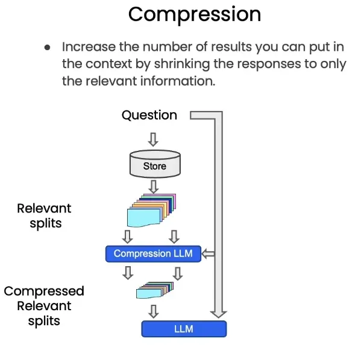

### Compression 方法的劣势

虽然 Compression 方法在提升上下文利用率和处理效率方面有显著的优势，但它也存在一些劣势：

- **信息丢失的风险**：在压缩的过程中，可能会丢失一些对用户问题虽然不是核心但仍有帮助的信息，导致模型的回答缺少细节或者关键的背景信息。
- **复杂性的增加**：引入 Compression 模型使得整个检索和生成的流程变得更加复杂，增加了系统的开发和维护成本。同时，压缩模型本身的效果对最终结果有很大影响，如果压缩不当，可能反而降低回答的质量。
- **压缩误差**：压缩过程中的算法选择和模型性能对最终保留的信息质量至关重要。如果 Compression LLM 在提炼过程中产生误差，可能会误删一些重要信息，进而影响回答的准确性。
- **依赖上下文理解**：Compression 方法依赖于模型对上下文的准确理解。如果模型对文本的理解不够深入，可能会错误地去掉一些实际上对回答有帮助的内容，导致最终生成的答案不够完善

## **总结**

这节课中，我们介绍了如何利用高级检索工具来优化信息检索的过程。**自查询检索器**、**LLM Aided Retrieval** 和 **Compression** 各自发挥作用，共同提升了信息检索的精度和效率。同时，我们也讨论了 Compression 方法的一些潜在劣势，理解这些劣势有助于我们在实际应用中更好地利用这些工具。

下节课我们将进入问题回复部分，探讨如何在检索的基础上结合生成模型，提供更加智能和高质量的答案。那我们下节课见啦！


# 问题回复

## 前言

在前两节课中，我们介绍了多种大模型的检索方法，包括基础的相似度搜索以及更高级的大语言模型辅助检索等技术。这些检索方法的核心目标，是从向量数据库中提取与问题最相关、最有价值的信息。

在掌握了这些方法之后，接下来我们将重点探讨如何将提取到的有用信息有效地传递给大模型，并使其能够基于检索到的信息生成更精准的回答。那相信大家都会好奇这到底是如何实现的，那就让带大家来看看吧！

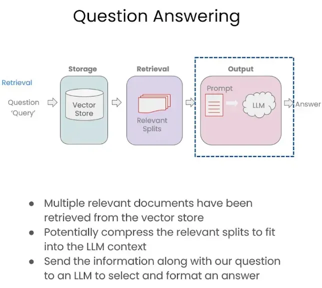

## **检索式问答链(RetrievalQA Chain)**

首先要介绍的就是我们最常见也最常使用的方法——检索式问答链（RetrievalQA Chain）。这是一种结合检索和生成的问答方法，旨在通过检索相关信息并利用大语言模型（LLM）生成精准答案。整个流程分为提问、检索相关文档、组合提示并生成答案几个主要阶段，是检索增强生成（Retrieval-Augmented Generation, RAG）方法的典型实现。

我们可以从下图看出其具体的流程解析：

- 提问和查询 用户提出问题后，系统会将问题转化为向量形式，并将其作为查询发送至向量存储（Vector Store）中。向量存储中包含了大量经过预处理的文档向量，可支持快速的相似度匹配。
- 检索相关信息 向量存储会根据问题的向量表示，返回多个最相关的文档片段（Relevant Splits）。这些文档片段通常包含了问题的答案或解答所需的关键背景信息。这也是我们前几节课探讨的重点内容。
- 提示词整合 系统将检索到的文档片段与用户的原始问题组合成提示（Prompt）。同时，系统会生成必要的背景信息（System Prompt），并保留用户的问题（Human Question），将所有信息整合成完整的上下文输入。
- 生成答案 系统将整合后的提示发送给大语言模型（LLM），模型会基于提供的上下文和问题生成精准的答案。由于答案建立在检索到的相关信息基础上，因此能够更准确地回应用户的问题。

我们其实本节课实战部分最重点要探讨的就是第三点——提示词整合，我们需要利用Langchain将提示词按照我们想要的格式进行组合后，传给大语言模型生成我们想要的回复。这个方案相比于最传统的将问题输入给大语言模型，其优势在于：

- **增强答案准确性**：通过结合检索结果与大语言模型的生成能力，大大提高了答案的相关性和准确性。
- **支持实时更新知识库**：检索过程依赖于向量存储中的数据，这些数据可以根据需要实时更新，确保答案反映最新的知识。
- **减轻模型记忆负担**：将知识库中的信息作为输入上下文，减少了对模型内部参数存储知识的依赖。

因此RetrievalQA Chain 可广泛应用于问答系统、智能客服和搜索增强任务等领域。在这些场景中，该方法不仅能快速检索相关信息，还能结合领域知识，生成高质量的答案，是解决复杂问答任务的有效工具。

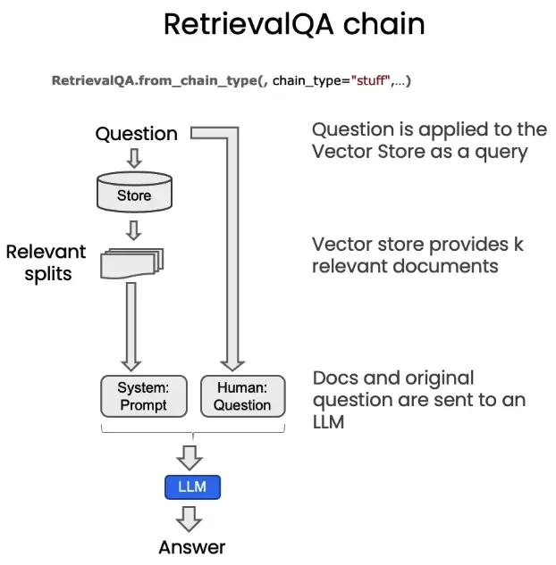

## **其他方法**

除了RetrievalQA Chain以外，如下图所示，还有其他的一些方法，比如map_reduce、Map_reank以及refine等。

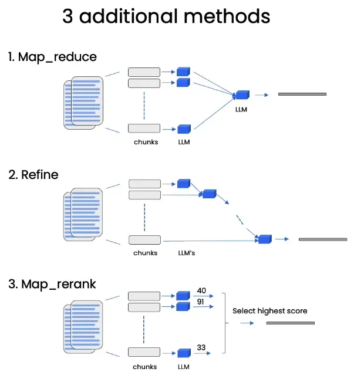

### **Map_reduce**

Map_reduce 方法将文档分成多个小块（chunks），每个块单独传递给语言模型（LLM）生成独立答案。然后，所有生成的答案会被合并成最终答案，合并过程（reduce）可能包括总结、投票等操作。

可以想象你有一本厚厚的书需要总结。这种方法会先把书分成多个小部分（称为“块”），然后每个部分都交给不同的助手，让他们各自生成一个答案。最后，你再把这些答案收集起来，用一种方式把它们合并成一个最终的答案（比如找出其中的主要观点，或者取平均结论）。

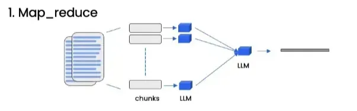

所以其流程大致如下：

1. **分块处理**：将文档拆成多个小部分。
2. **独立回答**：每个部分都交给大语言模型，分别生成独立的答案。
3. **答案归约**：把所有小答案综合起来，生成一个整体的答案。

从这里我们也可以看出，与RetrievalQA Chain相比，其会先检索一部分相关内容，再将问题和内容结合后生成答案。而 Map_reduce 是针对所有文档的每一部分单独生成答案，并通过合并提高效率，特别适合处理大量数据时的并行化任务。

### **Refine**

Refine 方法从第一个文档块中生成一个初始答案，然后对后续文档块逐一处理。每个块会对已有的答案进行补充或修正，直到所有块处理完成，最终得到经过优化和完善的答案。

通俗点说，假设你在写一篇论文，每次只写一段，然后再逐步修改和补充前面已经写好的内容。这种方法会先生成一个初始答案，然后再逐个查看文档的其余部分，看看是否需要修改答案，或者在答案上加上新的细节，直到答案足够完善。

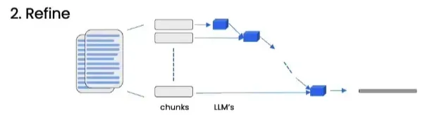

所以其流程大致如下：

1. **初步回答**：从第一个文档块中生成一个初始答案。
2. **逐步完善**：对于每一个后续文档块，逐一更新初始答案，使答案更加精确和全面。
3. **最终结果**：生成一个经过多轮完善的高质量答案。

所以和RetrievalQA Chain相比，RetrievalQA Chain是一次性用检索到的文档生成答案，没有后续的反复改进。而 Refine 方法会逐步地完善答案，更注重精细化和准确性，适合需要反复推敲和改进的任务。

### **Map_rerank**

Map_rerank 方法将文档分成多个块，每个块都单独生成答案，并给这些答案打分。打分依据可以是相关性、质量等指标，最后选择得分最高的答案作为最终输出。这就像一个比赛。每个文档块都生成一个答案，这些答案好比参赛者。然后，每个答案会被打分，分数越高代表越接近问题的需求。最后，选择分数最高的那个答案作为最终结果。

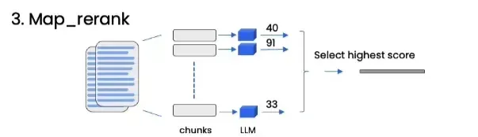

那具体的流程就是：

1. **分块处理**：文档被分成多个部分。
2. **单独生成答案**：每个部分生成一个答案。
3. **打分排序**：对每个答案进行打分（比如根据其相关性、完整性）。
4. **选择最佳答案**：选择分数最高的那个答案。

所以从上面就可以看出，RetrievalQA Chain 偏向于综合所有相关文档的信息，而 Map_rerank 更注重对生成答案的筛选，通过打分和排序选出一个最优答案，而不是结合所有内容。

### **小结**

针对以上面提到的四种方法，我们可以参考以下策略来进行选择。

- 如果需要处理大量文档并快速生成答案，建议选择 **Map_reduce**。它通过将文档分块并行处理，不仅节省时间，还能确保每个部分得到独立且完整的分析，特别适合大规模数据处理场景。
- 当对答案质量和细节有较高要求时，可以使用 **Refine**。它会在处理每个新文档块时逐步优化和补充答案，从而确保上下文连贯性并生成更精准的答案。
- 如果目标是找出最佳答案而非整合所有信息，可以采用 **Map_rerank**。通过对各个答案进行评分和排序，能够快速筛选出最相关、质量最高的结果。
- **RetrievalQA Chain** 则专注于将问题与检索到的相关信息结合，直接交由大语言模型生成答案。这种方法流程简单直接，虽然灵活性和针对性略低，但由于其效率高度依赖于检索内容的质量，非常适合处理通用问答场景。

## **实战练习**

那在今天的练习里，我们主要针对的就是我们最常使用的**RetrievalQA Chain**。那同样的，我们也要准备好以下的python库并对其进行安装。

```
langchain                0.3.0
langchain-community      0.3.0
pypdf                    5.0.0
openai                   1.47.0
beautifulsoup4           4.12.3
chromadb                 0.5.15
PyJWT                    2.10.1
```

为了满足本次任务的需求，我们不仅需要通过嵌入模型获取信息，还需调用大型语言模型（LLM）生成相应的回复。由于官方课程所使用的模型均为OpenAI系列的模型，这些模型都在国内的环境下无法使用。因此我选择了智谱AI推出的免费模型 **GLM-4-Flash** 进行演示。

**GLM-4-Flash**是智谱AI推出的首个免费大模型API，旨在让AI技术惠及更广泛的用户群体。该模型在语义理解、数学计算、推理、代码生成和知识应用等多个领域表现出色，支持高达1500的并发请求，能够满足大规模应用的需求。

使用GLM-4-Flash非常简便，用户只需登录智谱AI官网，完成注册后即可获取API Key，开始调用该模型的强大功能。这为开发者和企业提供了一个高效、低成本的解决方案，助力各类智能应用的快速开发和部署。

那为了能够实现智谱AI的调用，我们首先就需要在之前创建的环境下在终端输入以下指令安装PyJWT这个库。

```
pip install pyjwt -i https://pypi.org/simple
```

安装完成并在官网获取到API key后我们可以开始尝试调用一下智谱AI。

```python
# 导入所需的模块
from langchain_community.chat_models import ChatZhipuAI
from langchain_core.messages import AIMessage, HumanMessage, SystemMessage

# 初始化 ChatZhipuAI 对象，指定模型名称、温度参数和 API 密钥
chat = ChatZhipuAI(
    model="glm-4-flash",  # 使用的模型名称
    temperature=0.5,      # 生成文本的随机性，范围为0到1
    api_key="你的api_key"  # 智谱AI提供的API密钥
)

# 定义消息列表，包含 AI 消息、系统消息和人类消息
messages = [
    AIMessage(content="Hi."),  # AI 生成的消息
    SystemMessage(content="Your role is a poet."),  # 系统设定的角色信息
    HumanMessage(content="Write a short poem about AI in four lines."),  # 人类发送的消息
]

# 调用 chat 对象的 invoke 方法，传入消息列表，获取 AI 的回复
response = chat.invoke(messages)

# 输出 AI 生成的内容
print(response.content)  # 显示 AI 生成的关于人工智能的四行短诗
```

假如我们在终端可以看到以下内容大致就可以认定是成功调用LLM获取回复了。

```
Whispers weave through circuits, dreams in code,
Silent sages, in silicon they reside,
A symphony of zeros, ones, and bytes,
The age of artificial, where minds collide.
```

然后我们可以把之前用过的向量数据库相关的代码也放入，具体可以参考之前的课程内容。完整的代码如下所示。

```python
from langchain_community.chat_models import ChatZhipuAI
from langchain_core.messages import AIMessage, HumanMessage, SystemMessage
from langchain_community.embeddings import BaichuanTextEmbeddings
from langchain_chroma import Chroma  # 从 langchain_chroma 中引用 Chroma 类
from langchain_community.document_loaders import WebBaseLoader
from langchain.text_splitter import RecursiveCharacterTextSplitter

# 文件导入
loader = WebBaseLoader("https://zh.d2l.ai/")
docs = loader.load()

# 文本切分
text_splitter = RecursiveCharacterTextSplitter(
    chunk_size = 1500,
    chunk_overlap = 150
)
splits = text_splitter.split_documents(docs)

persist_directory = r'D:\langchain'

# 初始化嵌入
embeddings = BaichuanTextEmbeddings(baichuan_api_key="sk-83842453061e34d80b392edba11f62fe")

# 使用 embedding_function 参数初始化 Chroma
vectordb = Chroma(
    persist_directory=persist_directory,
    embedding_function=embeddings
)

chat = ChatZhipuAI(
    model="glm-4-flash",
    temperature=0.5,
    api_key =  "8cb13630530001eac693610d7b3a97dc.JkcrYlDKXAbtvv4x"
)

messages = [
    AIMessage(content="Hi."),
    SystemMessage(content="Your role is a poet."),
    HumanMessage(content="Write a short poem about AI in four lines."),
]

response = chat.invoke(messages)
print(response.content)  # Displays the AI-generated poem
```

下面我们就需要开始调用Langchain中所提供的**RetrievalQA chain**进行测试使用。

```python
from langchain_community.chat_models import ChatZhipuAI
from langchain_core.messages import AIMessage, HumanMessage, SystemMessage
from langchain_community.embeddings import ZhipuAIEmbeddings
from langchain_chroma import Chroma  # 从 langchain_chroma 中引用 Chroma 类
from langchain_community.document_loaders import WebBaseLoader
from langchain.text_splitter import RecursiveCharacterTextSplitter

# 文件导入
loader = WebBaseLoader("https://zh.d2l.ai/")
docs = loader.load()

# 文本切分
text_splitter = RecursiveCharacterTextSplitter(
    chunk_size = 1500,
    chunk_overlap = 150
)
splits = text_splitter.split_documents(docs)

persist_directory = './langchain-chroma'

# 初始化嵌入
embed = ZhipuAIEmbeddings(
    model="embedding-2",
    api_key="5713143e8fdc4b4a8b284cf97092e70f.qEK71mGIlavzO1Io",
)

# 使用 embedding_function 参数初始化 Chroma
vectordb = Chroma(
    persist_directory=persist_directory,
    embedding_function=embed
)

chat = ChatZhipuAI(
    model="glm-4-flash",
    temperature=0.5,
    api_key =  "5713143e8fdc4b4a8b284cf97092e70f.qEK71mGIlavzO1Io"
)

from langchain.chains import RetrievalQA
question = "这本书最重要的主题是?"
qa_chain = RetrievalQA.from_chain_type(
    chat, # 大模型的选用
    retriever=vectordb.as_retriever() # 向量数据库的调用
)
result = qa_chain({"query": question}) # 输入问题
print(result["result"]) # 获取回复
```

假如结果出现以下内容则意味着我们其实成功的进行了调用。正常来说大模型应该不知道说这本书是什么，但是结合了数据库的内容后，大语言模型清楚的知道我们所说的书就是这本由李沐大神所写的《动手学深度学习》。

```markdown
这本书最重要的主题是**深度学习**，特别是**动手实践**和**PyTorch框架**。它全面介绍了深度学习的核心概念、模型和算法，并通过大量的代码示例和实战项目，帮助读者将理论知识应用于实际问题的解决。

以下是书中涵盖的一些关键主题：

* **深度学习基础**：包括线性代数、微积分、概率论等基础知识，以及数据操作、数据预处理等技能。
* **线性神经网络**：介绍线性回归、softmax回归、多层感知机等基础模型。
* **深度学习计算**：讲解深度学习中的计算图、前向传播、反向传播等概念。
* **卷积神经网络**：介绍卷积神经网络的基本原理、结构和应用，包括LeNet、AlexNet、VGG、ResNet等模型。
* **循环神经网络**：介绍循环神经网络的基本原理、结构和应用，包括LSTM、GRU等模型。
* **注意力机制**：介绍注意力机制的基本原理和应用，包括Transformer模型。
* **优化算法**：介绍梯度下降、动量法、Adam算法等优化算法。
* **计算性能**：介绍深度学习中的计算性能优化方法，包括多GPU训练、参数服务器等。
* **计算机视觉**：介绍图像分类、目标检测、语义分割等计算机视觉任务。
* **自然语言处理**：介绍自然语言处理任务，包括情感分析、自然语言推断等。

总的来说，这本书旨在帮助读者全面掌握深度学习知识，并将其应用于解决实际问题。
```

除了直接这样调用以外，其实我们还可以设置一些提示词模型使其更加的清晰明了。那在Langchain中我们可以这样来进行调用：

1. 首先我们导入并创建一个template模版

```
from langchain.prompts import PromptTemplate

# Build prompt
template = """请使用以下上下文信息回答最后的问题。
如果您不知道答案，就直接说您不知道，不要试图编造答案。
回答最多使用三句话。请尽可能简洁地回答。最后一定要说“谢谢提问！”。
上下文：{context}
问题：{question}
有帮助的回答："""
QA_CHAIN_PROMPT = PromptTemplate.from_template(template)
```

1. 更新qa_chain里的内容并调用。

```
# Run chain
qa_chain = RetrievalQA.from_chain_type(
    chat,
    retriever=vectordb.as_retriever(),
    return_source_documents=True, # 这个可有可无，只是返回找到的源文件内容
    chain_type_kwargs={"prompt": QA_CHAIN_PROMPT}
)
```

1. 提供问题并调用

```
question = "这本书最重要的主题是?"
result = qa_chain({"query": question})
print(result["result"])
```

1. 显示找到的最相关的向量数据库片段（可不加入）

```
print(result["source_documents"][0])
```

根据以上内容输入后，我们会发现其回复有了明显的不同，首先是其回复更加的简洁了，只回答了这本书最重要的主题，而没有像之前一样长篇大论。另外就是真的最后加上了一句谢谢提问。这也就意味着我们通过调整提示词的内容真的可以实现指令控制来让大模型输出我们想让其输出的内容。

```
这本书最重要的主题是深度学习，涵盖了从基础知识到高级应用，包括各种模型、算法和实现方法。

谢谢提问！
```

本节课程完整的代码如下所示：

```python
from langchain_community.chat_models import ChatZhipuAI
from langchain_core.messages import AIMessage, HumanMessage, SystemMessage
from langchain_community.embeddings import ZhipuAIEmbeddings
from langchain_chroma import Chroma  # 从 langchain_chroma 中引用 Chroma 类
from langchain_community.document_loaders import WebBaseLoader
from langchain.text_splitter import RecursiveCharacterTextSplitter

# 文件导入
loader = WebBaseLoader("https://zh.d2l.ai/")
docs = loader.load()

# 文本切分
text_splitter = RecursiveCharacterTextSplitter(
    chunk_size = 1500,
    chunk_overlap = 150
)
splits = text_splitter.split_documents(docs)

persist_directory = './langchain-chroma'

# 初始化嵌入
embed = ZhipuAIEmbeddings(
    model="embedding-2",
    api_key="5713143e8fdc4b4a8b284cf97092e70f.qEK71mGIlavzO1Io",
)

# 使用 embedding_function 参数初始化 Chroma
vectordb = Chroma(
    persist_directory=persist_directory,
    embedding_function=embed
)

chat = ChatZhipuAI(
    model="glm-4-flash",
    temperature=0.5,
    api_key =  "5713143e8fdc4b4a8b284cf97092e70f.qEK71mGIlavzO1Io"
)

from langchain.chains import RetrievalQA
from langchain.prompts import PromptTemplate

# Build prompt
template = """请使用以下上下文信息回答最后的问题。
如果您不知道答案，就直接说您不知道，不要试图编造答案。
回答最多使用三句话。请尽可能简洁地回答。最后一定要说“谢谢提问！”。
上下文：{context}
问题：{question}
有帮助的回答："""
QA_CHAIN_PROMPT = PromptTemplate.from_template(template)

# Run chain
qa_chain = RetrievalQA.from_chain_type(
    chat,
    retriever=vectordb.as_retriever(),
    return_source_documents=True, # 这个可有可无，只是返回找到的源文件内容
    chain_type_kwargs={"prompt": QA_CHAIN_PROMPT}
)

question = "这本书最重要的主题是?"
result = qa_chain({"query": question})
print(result["result"])
```

## **总结**

通过本节的学习，我们从理论到实战，全面了解了检索增强生成（RAG）的多种方法，特别是 **RetrievalQA Chain** 在实际场景中的强大表现。同时，我们还尝试通过提示词优化，让大语言模型更贴合我们的需求输出精准答案。相信随着这些技术的不断发展，我们离更智能、更贴心的 AI 助手又近了一步。如果你也对这些技术感兴趣，不妨亲自试一试，把这些工具融入到自己的项目中。

在下一节课中，我们将学习如何通过加入 **Chat History**，让大模型“记住”对话历史，从而实现流畅自然的多轮对话。同时，还会探讨如何高效存储和管理对话记录，确保系统既智能又高效。想让你的 AI 更懂“人话”？下一节绝对不容错过！

# 对话

## **前言**

经过了之前所有课程的学习，我们已经对数据处理和智能检索的全流程有了一个全面的了解。从海量信息中提取有价值的内容，这似乎是一件复杂而高深的事情，但其实背后的原理却有迹可循。这张图直观地呈现了整个流程：从文档加载到切分存储，再到高效检索和最终输出答案，每一步都环环相扣，缺一不可。


在课程中，我们不仅学会了如何从多种数据源获取文档，还掌握了切分文档的策略，以及向量化存储的核心技术。更重要的是，我们深入探索了如何通过精准的检索算法快速获取所需内容，并利用大型语言模型（LLM）生成高质量的答案。这些知识不仅让我们对技术有了更深的理解，也为未来的实际应用打下了坚实的基础。

本节课将带领大家深入探讨 Conversational Retrieval Chain（对话检索链）的技术架构，并通过实际案例演示，展示其如何结合对话历史和智能检索能力，动态地从知识库中提取与用户问题相关的信息，并通过大型语言模型生成准确的答案。这也是langchain正课中最后的一节课了，后续的课程中我们将会深入的探讨langchain的具体使用方式以及其局限性，从而更好的帮助我们进行大模型的开发工作。

## **Conversational Retrieval Chain**

**Conversational Retrieval Chain** 是一种结合对话历史和智能检索能力的技术架构，用于动态地从知识库中提取与用户问题相关的信息，并通过大型语言模型（LLM）生成准确的答案。其主要目标是让用户可以在自然对话中获得准确、上下文相关的回答。

我们可以从下图看出其整体的流程：

1. **对话历史（Chat History）：** 系统会记录用户的对话上下文，作为后续问题处理的重要输入。
2. **问题输入（Question）：** 用户提出的问题被发送到检索模块。
3. **检索器（Retriever）：** 系统通过检索器从向量数据库中提取与问题相关的内容（Relevant Splits）。
4. **上下文结合（System & Human）：** 系统将用户问题和提取的相关信息整合到 Prompt 中，为语言模型提供结构化输入。
5. **大型语言模型（LLM）：** LLM 基于上下文生成答案，并返回给用户。


相比起上节课我们学习到的**RetrievalQA Chain（[吴恩达DeepLearning.AI课程系列 - 大模型检索增强生成（六）：问题回复](https://mp.weixin.qq.com/s?__biz=Mzg2NzU4MDgzMA==&mid=2247530347&idx=1&sn=184d1a966768378992ab5b36958d6eb7&scene=21#wechat_redirect)）**，其最大的差异在于Chat History的使用。假如没有聊天记录的存在，我们每次与大语言模型的对话都是全新的对话。大语言模型不知道我们之前说过什么，因此每次的回复都是依靠着其本能进行回复。而假如我们加上了聊天记录，那么我们之前给他们设定的角色提出的要求就能够保留在记忆里，下次再问到的时候就不再需要重新进行调教了。

类似的，其实我们这节课一直以来强调的检索增强其实也是某种意义上的“历史记录”。向量数据库中记录的是之前或者说我们希望大模型知道的相关知识，而这些知识的提供同样能够让大模型摆脱单纯对于自身本能的依赖，进而能够借助更多的知识提供更全面更符合我们想法的回复。

那下面就让我们一起来看看这神奇的”聊天记录“是怎么样具体在代码层面上来操作的吧！

## **实操演示**

### **环境准备**

那在今天的练习里，我们也要准备好以下的python库并对其进行安装。

```
langchain                0.3.0
langchain-community      0.3.0
pypdf                    5.0.0
openai                   1.47.0
beautifulsoup4           4.12.3
chromadb                 0.5.15
PyJWT                    2.10.1
```

### **过去代码**

上节课我们使用的完整代码如下所示。

```
from langchain_community.chat_models import ChatZhipuAI
from langchain_core.messages import AIMessage, HumanMessage, SystemMessage
from langchain_community.embeddings import BaichuanTextEmbeddings
from langchain_chroma import Chroma  # 从 langchain_chroma 中引用 Chroma 类
from langchain_community.document_loaders import WebBaseLoader
from langchain.text_splitter import RecursiveCharacterTextSplitter

# 文件导入
loader = WebBaseLoader("https://zh.d2l.ai/")
docs = loader.load()

# 文本切分
text_splitter = RecursiveCharacterTextSplitter(
    chunk_size = 1500,
    chunk_overlap = 150
)
splits = text_splitter.split_documents(docs)

persist_directory = r'D:\langchain'

# 初始化嵌入
embeddings = BaichuanTextEmbeddings(baichuan_api_key="你的api_key")

# 使用 embedding_function 参数初始化 Chroma
vectordb = Chroma(
    persist_directory=persist_directory,
    embedding_function=embeddings
)

chat = ChatZhipuAI(
    model="glm-4-flash",
    temperature=0.5,
    api_key =  "你的api_key"
)

from langchain.chains import RetrievalQA
from langchain.prompts import PromptTemplate

# Build prompt
template = """请使用以下上下文信息回答最后的问题。
如果您不知道答案，就直接说您不知道，不要试图编造答案。
回答最多使用三句话。请尽可能简洁地回答。最后一定要说“谢谢提问！”。
上下文：{context}
问题：{question}
有帮助的回答："""
QA_CHAIN_PROMPT = PromptTemplate.from_template(template)

# Run chain
qa_chain = RetrievalQA.from_chain_type(
    chat,
    retriever=vectordb.as_retriever(),
    return_source_documents=True, # 这个可有可无，只是返回找到的源文件内容
    chain_type_kwargs={"prompt": QA_CHAIN_PROMPT}
)

question = "这本书最重要的主题是?"
result = qa_chain({"query": question})
print(result["result"])
```

### **Memory**

在langchian中提供了一个简便的记忆力工具ConversationBufferMemory，我们可以直接导入进来代码之中。`ConversationBufferMemory` 是 `LangChain` 框架中的一个内存模块，用于管理对话历史记录。它的主要功能是以缓冲区的形式存储用户和 AI 之间的对话内容，并在需要时返回这些记录，从而使模型能够在上下文一致的情况下生成响应。

- 该模块主要参数和功能
  1. **`memory_key`：**用于指定存储对话历史记录的键名。这个键名可以在其他模块（如链或工具）中引用。
  2. **`return_messages`**：如果设置为 `True`，返回的对话历史记录是一个消息对象列表（如用户消息和 AI 消息对象）。如果设置为 `False`，返回的是一个字符串，将所有消息拼接成一个文本块。

```
from langchain.memory import ConversationBufferMemory
memory = ConversationBufferMemory(
    memory_key="chat_history",
    return_messages=True
)
```

然后我们还需要注释掉原本RetrievalQA后，将我们这节课所需要使用的ConversationalRetrievalChain也同样进行导入，并为其进行基础的配置。

```
from langchain.chains import ConversationalRetrievalChain
retriever=vectordb.as_retriever()
qa = ConversationalRetrievalChain.from_llm(
    chat,
    retriever=retriever,
    memory=memory
)
```

然后我们就可以传入我们的问题进行尝试了。

```
# 第一次提问，明确告诉模型要记住的信息
question = "这本书有讲到关于计算机视觉的内容吗?不超过100字。"
result = qa.invoke({"question": question})
print(result['answer'])

# 第二次提问，模型会基于记忆回答
question = "请用几句话介绍一下这个主题可以吗？不超过100字。"
result = qa.invoke({"question": question})
print(result['answer'])
```

然后运行代码我们就能看到以下的回复：

```
# 第一次问题的回复
是的，这本书涵盖了计算机视觉的内容，包括图像增广、微调、目标检测、语义分割、风格迁移等，并介绍了R-CNN系列、SSD、全卷积网络等模型。
# 第二次问题的回复
根据目录，这本书涵盖了以下计算机视觉相关内容：

**1. 计算机视觉基础**：

* 图像增广
* 微调
* 目标检测和边界框
* 锚框
* 多尺度目标检测
* 目标检测数据集
* 单发多框检测（SSD）
* 区域卷积神经网络（R-CNN）系列
* 语义分割和数据集
* 转置卷积
* 全卷积网络
* 风格迁移

**2. 实战案例**：

* 实战 Kaggle 比赛：图像分类 (CIFAR-10)
* 实战Kaggle比赛：狗的品种识别（ImageNet Dogs）

**3. 相关技术**：

* 卷积神经网络（CNN）
* 目标检测
* 语义分割

**4. 应用领域**：

* 图像分类
* 目标检测
* 语义分割
* 风格迁移

**总结**：

这本书提供了计算机视觉领域的全面概述，包括基础知识、关键技术、实战案例和应用领域，适合不同层次的读者 学习和了解计算机视觉。
```

可以看出，在增加了memory功能后，上一次的问题和回复就会被加入到下一次问题的对话当中了，模型也记住我们上面问的主题是“计算机视觉”，然后在后面给的也是和“计算机视觉”相关的回复了。

完整代码如下所示：

```
from langchain_community.chat_models import ChatZhipuAI
from langchain_core.messages import AIMessage, HumanMessage, SystemMessage
from langchain_community.embeddings import BaichuanTextEmbeddings
from langchain_chroma import Chroma
from langchain_community.document_loaders import WebBaseLoader, PyMuPDFLoader
from langchain.text_splitter import RecursiveCharacterTextSplitter
from langchain.memory import ConversationBufferMemory
from langchain.chains import ConversationalRetrievalChain

# 文件导入
loader = WebBaseLoader("https://zh.d2l.ai/")
docs = loader.load()

# 文本切分
text_splitter = RecursiveCharacterTextSplitter(
    chunk_size=1500,
    chunk_overlap=150
)
splits = text_splitter.split_documents(docs)

# 初始化嵌入
persist_directory = r'D:\langchain'
embeddings = BaichuanTextEmbeddings(baichuan_api_key="sk-83842453061e34d80b392edba11f62fe")

vectordb = Chroma(
    persist_directory=persist_directory,
    embedding_function=embeddings
)

# 初始化聊天模型
chat = ChatZhipuAI(
    model="glm-4-flash",
    temperature=0.5,
    api_key="8cb13630530001eac693610d7b3a97dc.JkcrYlDKXAbtvv4x"
)

# 初始化内存
memory = ConversationBufferMemory(
    memory_key="chat_history",
    return_messages=True
)

# 创建 ConversationalRetrievalChain
retriever = vectordb.as_retriever()
qa = ConversationalRetrievalChain.from_llm(
    chat,
    retriever=retriever,
    memory=memory
)

# 第一次提问，明确告诉模型要记住的信息
question = "这本书有讲到关于计算机视觉的内容吗?不超过100字。"
result = qa.invoke({"question": question})
print(result['answer'])

# 第二次提问，模型会基于记忆回答
question = "请用几句话介绍一下这个主题可以吗？不超过100字。"
result = qa.invoke({"question": question})
print(result['answer'])
```

## **总结**

总的来说，本课程深入探讨了数据处理与智能检索技术。我们学习了完整的处理流程，包括文档加载、切分存储、精准检索，以及利用大语言模型生成答案。相比传统的 RetrievalQA Chain，Conversational Retrieval Chain 通过融合对话历史与智能检索功能，能够更好地理解上下文，提供连贯且高质量的回应。在实践环节，我们配置了必要的 Python 库，完成了从文档处理到问答链的构建。通过引入 ConversationBufferMemory 实现对话记忆功能，我们成功展示了模型如何准确理解上下文并做出恰当回应。

到这里，我们的"Langchain：Chat With Data"课程圆满结束了！在这门课程中，我们深入探讨了RAG技术的核心概念和应用，不仅掌握了检索增强生成的基本原理，还学习了多种实现方法和技术框架。通过实践，我们了解了从文档处理到智能对话的完整流程，以及如何运用不同的工具和策略来优化检索效果。这些知识将为我们未来开发更智能的数据交互系统打下坚实的基础。此外，在下一周，我还准备了一个特别的小彩蛋：通过结合前端与后端实际操作的展示，完整呈现 RAG 技术在真实环境下的互动应用。敬请期待！那我们下周不见不散！


# 构建RAG前端交互界面

假如我们不仅仅是希望能够在 VSCode 里运行我们的多轮对话文件，而是希望能够真正的在一个前端界面上运行，可能我们就需要借助一下 Gradio 的前端制作能力并开始以下的操作。

## **界面制作**

首先我们简单的思考一下要做一个基于 RAG 对话的前端界面需要什么。当然最基础也是必须的就是我们上传文件的一个位置或者说填写链接的位置。RAG 的基础就是我们个性化的数据，所以这个界面必不可少。

在接收完文件并使其转化为向量数据库后，我们就要开始制作对话的界面了，那么对于对话而言，就是一问一答。所以基于这个想法我们就可以开始进行尝试了。

首先还是需要在终端先安装一下 gradio 这个库。

```
pip install gradio
```

然后创建一个新的 py 文件来写入界面的代码：

```
import gradio as gr

# 创建 Gradio 应用
with gr.Blocks() as demo:
    # 写入标题并居中
    gr.Markdown('# 基础 RAG 对话平台')

    # 创建一行布局
    with gr.Row():
        # 创建左侧列
        with gr.Column():
            # 创建一个文本框接收网页地址
            url = gr.Textbox(label='请输入网页地址')

            # 创建一个按钮，点击后生成向量数据库
            url_loader_button = gr.Button('点击生成向量数据库')

            # 创建一个文件上传组件接收文件
            document = gr.File(label='请上传文件')

            # 创建一个按钮，点击后生成向量数据库
            document_loader_button = gr.Button('点击生成向量数据库')

            # 创建一个 Markdown 块接收数据库生成的情况
            information = gr.Markdown()

        # 创建右侧列
        with gr.Column():
            # 创建一个 Chatbot 组件记录聊天内容
            chat_history = gr.Chatbot(label='聊天记录', type="messages")

            # 创建一个文本区域记录要问的问题
            input_message = gr.TextArea(label='内容输入')

# 发布前端界面
demo.launch()
```

这个就是一个最基础的 gradio 界面的写法，我们首先通过 Markdown 来写入一个标题，然后通过 `gr.Row()` 来创建行布局，然后再用两个 `gr.Column()` 来将这行拆分成了不同的两列。那这两列左边就是我们上传文件并生成向量数据库的位置，右边的就是我们与大模型对话的位置。具体样式如下图所示：

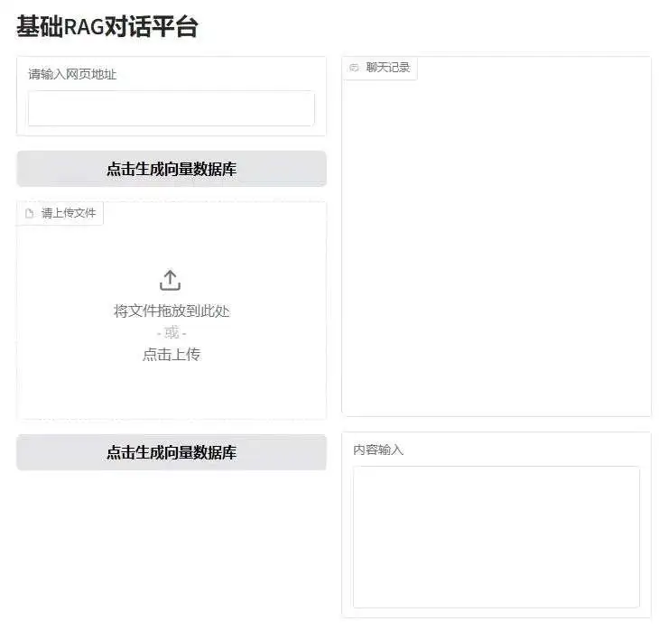

## **文件上传**

当我们做好了前端界面后，我们就可以基于前端的界面来创建一个后端的系统了。那对于前端上传了一个文件，大家可以想想后端是要怎么来进行处理呢？其实回到我们的代码文件里大家就可以发现，那就是：

- 文件导入：将上传到前端的文件进行处理并生成 docs。
- 文本切分及嵌入：对传入的文件进行切分并利用 embedding 模型转为向量的形式。
- 向量数据库：有了一堆的词向量后，就利用 chroma 将其转为一个向量数据库 vectordb。

所以我们可以看出，虽然前端只是上传了一个文件，但是后端其实是需要完成很多的工作的，一直到将这个文件的数据库创建出来为止。由此我们就可以知道，对于这个代码而言，我们的输入就是文件地址或网页链接，而输出的内容就是这个数据库的地址。

那我们其实就可以开始写一部分这样的代码了，首先我们一般上传的话都是文本类的文件，比如说 `.txt`, `.pdf`, `.docx`, `.md`, `.xlsx` 文件，或者说是网页（比如说 YouTube 等）。因此我们可以先把导入文件所需的库导入并将其作为一个函数写入。

在使用前，你需要在终端安装以下的库：

```
pip install langchain pymupdf docx2txt unstructured requests pytube
from langchain_community.document_loaders import (
    TextLoader,
    PyMuPDFLoader,
    Docx2txtLoader,
    UnstructuredMarkdownLoader,
    UnstructuredExcelLoader,
    WebBaseLoader,
    YoutubeLoader
)

def load_document(file_path: str):
    """
    根据文件路径加载文件并返回 docs。

    :param file_path: 文件路径
    :return: 加载的文档
    """
    # 获取文件后缀名
    file_type = file_path.split('.')[-1].lower()

    # 根据文件类型选择合适的 Loader
    if file_type == 'txt':
        loader = TextLoader(file_path)
    elif file_type == 'pdf':
        loader = PyMuPDFLoader(file_path)
    elif file_type == 'docx':
        loader = Docx2txtLoader(file_path)
    elif file_type == 'md':
        loader = UnstructuredMarkdownLoader(file_path)
    elif file_type == 'xlsx':
        loader = UnstructuredExcelLoader(file_path)
    else:
        raise ValueError(f"不支持的文件类型: {file_type}")

    # 加载文档
    docs = loader.load()
    return docs

def load_web_content(url: str):
    """
    根据 URL 加载网页内容或 YouTube 视频信息并返回 docs。

    :param url: 网页或 YouTube 视频的 URL
    :return: 加载的文档
    """
    # 判断内容类型
    if 'youtube.com' in url or 'youtu.be' in url:
        loader = YoutubeLoader(url)
    else:
        loader = WebBaseLoader(url)

    # 加载内容
    docs = loader.load()
    except Exception as e:
        raise ValueError(f"Error loading content from URL: {url}. Details: {e}")

    return docs
```

接下来我们就需要接着 docs 后面继续写，把之后拓展的内容都写入。但是现在我们的文件保存地址就需要有所变更了，不能再是 D 盘的 langchain 文件了，而是利用 os 库实现的定位当前文件夹并确定保存的文件夹了。当然前面导入的库也要一并复制过来。

```
import os
from langchain_community.chat_models import ChatZhipuAI
from langchain_core.messages import AIMessage, HumanMessage, SystemMessage
from langchain_community.embeddings import BaichuanTextEmbeddings
from langchain_chroma import Chroma
from langchain.text_splitter import RecursiveCharacterTextSplitter
from langchain.memory import ConversationBufferMemory
from langchain.chains import ConversationalRetrievalChain
from langchain_community.document_loaders import (
    TextLoader,
    PyMuPDFLoader,
    Docx2txtLoader,
    UnstructuredMarkdownLoader,
    UnstructuredExcelLoader,
    WebBaseLoader,
    YoutubeLoader
)

def load_document(file_path: str):
    """
    根据文件路径加载文件并返回 docs。

    :param file_path: 文件路径
    :return: 加载的文档
    """
    # 获取文件后缀名
    file_type = file_path.split('.')[-1].lower()

    # 根据文件类型选择合适的 Loader
    if file_type == 'txt':
        loader = TextLoader(file_path)
    elif file_type == 'pdf':
        loader = PyMuPDFLoader(file_path)
    elif file_type == 'docx':
        loader = Docx2txtLoader(file_path)
    elif file_type == 'md':
        loader = UnstructuredMarkdownLoader(file_path)
    elif file_type == 'xlsx':
        loader = UnstructuredExcelLoader(file_path)
    else:
        raise ValueError(f"不支持的文件类型: {file_type}")

    # 加载文档
    docs = loader.load()
    # 文本切分
    text_splitter = RecursiveCharacterTextSplitter(
        chunk_size=1500,
        chunk_overlap=150
    )
    splits = text_splitter.split_documents(docs)

    # 初始化嵌入
    # 获取当前文件夹路径
    current_directory = os.path.dirname(os.path.abspath(__file__))
    persist_directory = os.path.join(current_directory, 'vectordb')
    embeddings = BaichuanTextEmbeddings(baichuan_api_key="sk-83842453061e34d80b392edba11f62fe")
    # 将 vectordb 设为全局变量以便后续使用
    global vectordb
    vectordb = Chroma(
        persist_directory=persist_directory,
        embedding_function=embeddings
    )
    return f"已成功在 {persist_directory} 文件夹生成向量数据库"

def load_web_content(url: str):
    """
    根据 URL 加载网页内容或 YouTube 视频信息并返回 docs。

    :param url: 网页或 YouTube 视频的 URL
    :return: 加载的文档
    """
    # 判断内容类型
    if 'youtube.com' in url or 'youtu.be' in url:
        loader = YoutubeLoader(url)
    else:
        loader = WebBaseLoader(url)

    # 加载内容
    docs = loader.load()
    # 文本切分
    text_splitter = RecursiveCharacterTextSplitter(
        chunk_size=1500,
        chunk_overlap=150
    )
    splits = text_splitter.split_documents(docs)
    # 初始化嵌入
    # 获取当前文件夹路径
    current_directory = os.path.dirname(os.path.abspath(__file__))
    persist_directory = os.path.join(current_directory, 'vectordb')
    embeddings = BaichuanTextEmbeddings(baichuan_api_key="sk-83842453061e34d80b392edba11f62fe")
    
    # 将 vectordb 设为全局变量以便后续使用
    global vectordb
    vectordb = Chroma(
        persist_directory=persist_directory,
        embedding_function=embeddings
    )
    return f"已成功在 {persist_directory} 文件夹生成向量数据库"
```

这里其实有一个点比较值得说的就是这个 vectordb，由于我们很难直接通过 gradio 里的某一个组件使其直接将 return 的 vectordb 接收，并且在 Langchain 的 Chroma 里也没有找到直接能够通过路径来获取向量数据库的方法，因此使用全局变量将其应用于整个文件中就是一个比较好的方法了。

## **对话界面**

对于聊天界面而言，我们同样也可以去思考一下其到底需要什么才能开始正常运作：

- 首先我们提出的问题肯定是必须要有的，也就是之前看到的 question
- 其次是由于我们是带 Memory 且使用 Chatbot 去记录的，因此这个聊天记录也应该被传入
- 再然后就是我们上面创建好的 vectordb 也是需要被载入的对吧，因为这个是我们与文档进行对话的基础。不然我们就直接体验一问一答就好了。但由于上面已经将 vectordb 全局化了，因此也不需要载入了。

那我们的输出大家觉得是什么呢？

- 首先由于我们的展示界面是一个 Chatbot，那自然我们的输出就应该是 Chatbot 的聊天记录了。
- 那其次我们其实输入完内容后，我们会希望输入内容部分会每次问完问题后清楚，因此将空白的输出返回也是必要的。

根据这个需求，我们就可以写出以下代码：

```
memory = ConversationBufferMemory(memory_key="chat_history", return_messages=True)

def chat(question, chat_history):
    # 初始化聊天模型
    chat = ChatZhipuAI(
        model="glm-4-flash",
        temperature=0.5,
        api_key="api_key" # 请替换成你自己的 API Key
    )     
    # 创建 ConversationalRetrievalChain
    retriever = vectordb.as_retriever()
    qa = ConversationalRetrievalChain.from_llm(
        chat,
        retriever=retriever,
        memory=memory # 使用外部传入的 memory
    )
    # 获取回复
    result = qa.invoke({"question": question})
    # 添加聊天记录到 Chatbot 中
    chat_history.append({"role": "user", "content": question})
    chat_history.append({"role": "assistant", "content": result['answer']})

    return chat_history, ""
```

需要注意的是，由于 memory 是一直在改变的，因此也应该把 memory 放在全局变量的位置。但是之所以没有放在函数内部，这是因为 memory 每次触发的时候都会重置聊天记录的信息，因此我们直接将其放在函数的外围进行使用。

## **函数与 Gradio 界面整合**

在写完两个函数，我们其实还需要把 gradio 界面的按钮或者文本块与我们写的两个函数进行联动，这样才能真正的动起来。

首先对于向量数据库的两个函数我们要与两个按钮进行联动。在 gradio 中的 button 可以有 `.click` 的方法（inputs 就是输入的变量（与函数一致），outputs 就是输出的内容（也得找一个位置进行存放），就是点击一下就生效一下，具体效果如下所示：

```
# 创建 Gradio 应用
with gr.Blocks() as demo:
    # 写入标题并居中
    gr.Markdown('# 基础 RAG 对话平台')

    # 创建一行布局
    with gr.Row():
        # 创建左侧列
        with gr.Column():
            # 创建一个文本框接收网页地址
            url = gr.Textbox(label='请输入网页地址')

            # 创建一个按钮，点击后生成向量数据库
            url_loader_button = gr.Button('点击生成向量数据库')

            # 创建一个文件上传组件接收文件
            document = gr.File(label='请上传文件')

            # 创建一个按钮，点击后生成向量数据库
            document_loader_button = gr.Button('点击生成向量数据库')

            # 创建一个 Markdown 块接收数据库生成的情况
            information = gr.Markdown()
            # 按钮 1
            url_loader_button.click(fn = load_web_content, inputs= url , outputs= information)
            # 按钮 2
            document_loader_button.click(fn = load_document, inputs = document, outputs = information)
```

然后对于内容输入，我们常用的与大模型的交互就是按下 enter 回车键的方式，那在 gradio 的文本块也有一个 `.submit` 的方式，就是通过按住 shift + enter 的方式来将文本连接到函数上。具体代码如下所示：

```
        # 创建右侧列
        with gr.Column():
            # 创建一个 Chatbot 组件记录聊天内容
            chat_history = gr.Chatbot(label='聊天记录', type="messages")

            # 创建一个文本区域记录要问的问题
            input_message = gr.TextArea(label='内容输入')

            # shift + enter 实现 submit 的操作
            input_message.submit(fn = chat, inputs=[input_message, chat_history],outputs=[chat_history, input_message])
```

这样我们就创建好自己的 RAG 平台，我们可以上传自己的文本文档文件或链接来生成自己的向量数据库并进行使用。最终完整的代码如下所示：

```
import gradio as gr
import os
from langchain_community.chat_models import ChatZhipuAI
from langchain_core.messages import AIMessage, HumanMessage, SystemMessage
from langchain_community.embeddings import BaichuanTextEmbeddings
from langchain_chroma import Chroma
from langchain.text_splitter import RecursiveCharacterTextSplitter
from langchain.memory import ConversationBufferMemory
from langchain.chains import ConversationalRetrievalChain
from langchain_community.document_loaders import (
    TextLoader,
    PyMuPDFLoader,
    Docx2txtLoader,
    UnstructuredMarkdownLoader,
    UnstructuredExcelLoader,
    WebBaseLoader,
    YoutubeLoader
)

def load_document(file_path: str):
    """
    根据文件路径加载文件并返回 docs。

    :param file_path: 文件路径
    :return: 加载的文档
    """
    # 获取文件后缀名
    file_type = file_path.split('.')[-1].lower()

    # 根据文件类型选择合适的 Loader
    if file_type == 'txt':
        loader = TextLoader(file_path)
    elif file_type == 'pdf':
        loader = PyMuPDFLoader(file_path)
    elif file_type == 'docx':
        loader = Docx2txtLoader(file_path)
    elif file_type == 'md':
        loader = UnstructuredMarkdownLoader(file_path)
    elif file_type == 'xlsx':
        loader = UnstructuredExcelLoader(file_path)
    else:
        raise ValueError(f"不支持的文件类型: {file_type}")

    # 加载文档
    docs = loader.load()
    # 文本切分
    text_splitter = RecursiveCharacterTextSplitter(
        chunk_size=1500,
        chunk_overlap=150
    )
    splits = text_splitter.split_documents(docs)

    # 初始化嵌入
    # 获取当前文件夹路径
    current_directory = os.path.dirname(os.path.abspath(__file__))
    persist_directory = os.path.join(current_directory, 'vectordb')
    embeddings = BaichuanTextEmbeddings(baichuan_api_key="sk-83842453061e34d80b392edba11f62fe")
    global vectordb
    vectordb = Chroma(
        persist_directory=persist_directory,
        embedding_function=embeddings
    )
    return f"已成功在 {persist_directory} 文件夹生成向量数据库"

def load_web_content(url: str):
    """
    根据 URL 加载网页内容或 YouTube 视频信息并返回 docs。

    :param url: 网页或 YouTube 视频的 URL
    :return: 加载的文档
    """
    # 判断内容类型
    if 'youtube.com' in url or 'youtu.be' in url:
        loader = YoutubeLoader(url)
    else:
        loader = WebBaseLoader(url)

    # 加载内容
    docs = loader.load()
    # 文本切分
    text_splitter = RecursiveCharacterTextSplitter(
        chunk_size=1500,
        chunk_overlap=150
    )
    splits = text_splitter.split_documents(docs)
    # 初始化嵌入
    # 获取当前文件夹路径
    current_directory = os.path.dirname(os.path.abspath(__file__))
    persist_directory = os.path.join(current_directory, 'vectordb')
    embeddings = BaichuanTextEmbeddings(baichuan_api_key="sk-83842453061e34d80b392edba11f62fe")
    global vectordb
    vectordb = Chroma(
        persist_directory=persist_directory,
        embedding_function=embeddings
    )
    return f"已成功在 {persist_directory} 文件夹生成向量数据库"

memory = ConversationBufferMemory(memory_key="chat_history", return_messages=True)

def chat(question, chat_history):
    # 初始化聊天模型
    chat = ChatZhipuAI(
        model="glm-4-flash",
        temperature=0.5,
        api_key="8cb13630530001eac693610d7b3a97dc.JkcrYlDKXAbtvv4x" # 请替换成你自己的 API Key
    )     
    # 创建 ConversationalRetrievalChain
    retriever = vectordb.as_retriever()
    qa = ConversationalRetrievalChain.from_llm(
        chat,
        retriever=retriever,
        memory=memory # 使用外部传入的 memory
    )
    result = qa.invoke({"question": question}) 
    chat_history.append({"role": "user", "content": question})
    chat_history.append({"role": "assistant", "content": result['answer']})

    return chat_history, ""

# 创建 Gradio 应用
with gr.Blocks() as demo:
    # 写入标题并居中
    gr.Markdown('# 基础 RAG 对话平台')

    # 创建一行布局
    with gr.Row():
        # 创建左侧列
        with gr.Column():
            # 创建一个文本框接收网页地址
            url = gr.Textbox(label='请输入网页地址')

            # 创建一个按钮，点击后生成向量数据库
            url_loader_button = gr.Button('点击生成向量数据库')

            # 创建一个文件上传组件接收文件
            document = gr.File(label='请上传文件')

            # 创建一个按钮，点击后生成向量数据库
            document_loader_button = gr.Button('点击生成向量数据库')

            # 创建一个 Markdown 块接收数据库生成的情况
            information = gr.Markdown()

            url_loader_button.click(fn = load_web_content, inputs= url , outputs= information)
            document_loader_button.click(fn = load_document, inputs = document, outputs = information)

        # 创建右侧列
        with gr.Column():
            # 创建一个 Chatbot 组件记录聊天内容
            chat_history = gr.Chatbot(label='聊天记录', type="messages")

            # 创建一个文本区域记录要问的问题
            input_message = gr.TextArea(label='内容输入')

            input_message.submit(fn = chat, inputs=[input_message, chat_history],outputs=[chat_history, input_message])

# 发布前端界面
demo.launch()
```