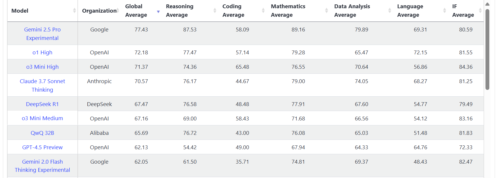
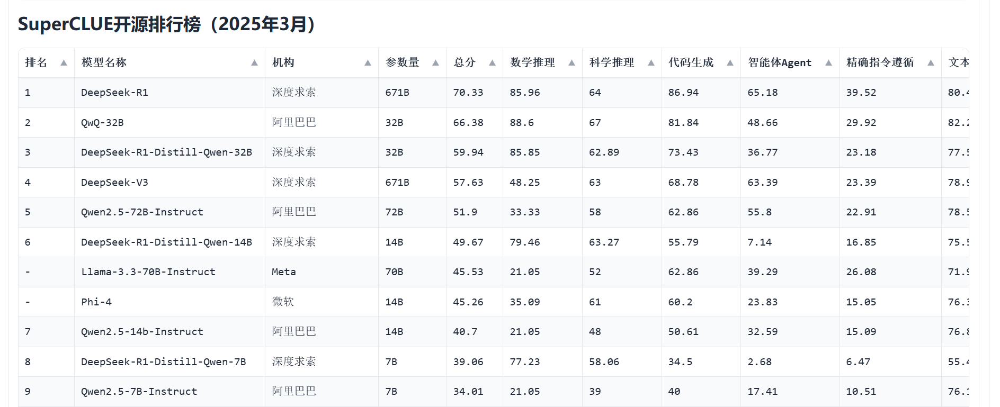
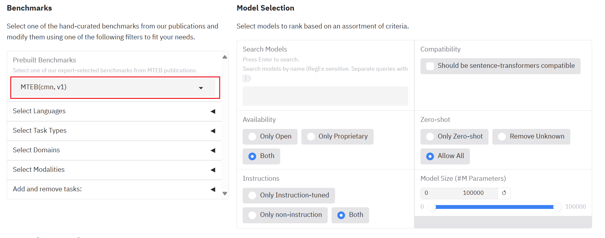

## RAG中大模型的选择

1. **LiveBench**

[LiveBench: A Challenging, Contamination-Free LLM Benchmark](https://livebench.ai/#/)

2. **SuperCLUE中文榜单**

[中文通用大模型的综合性测评基准 SuperCLUE](https://www.cluebenchmarks.com/static/superclue.html)

[SuperCLUE-RAG 检索增强生成测评](https://www.superclueai.com/)

## Embedding模型的选择

[MTEB](https://huggingface.co/spaces/mteb/leaderboard)

[C-MTEB](https://huggingface.co/spaces/mteb/leaderboard)

