## 💡 RAGFlow 是什么？


[RAGFlow](https://ragflow.io/) 是一款领先的开源检索增强生成（RAG）引擎，通过融合前沿的 RAG 技术与 Agent 能力，为大型语言模型提供卓越的上下文层。它提供可适配任意规模企业的端到端 RAG 工作流，凭借融合式上下文引擎与预置的 Agent 模板，助力开发者以极致效率与精度将复杂数据转化为高可信、生产级的人工智能系统。

## 🎮 Demo 试用


请登录网址 [https://demo.ragflow.io](https://demo.ragflow.io/) 试用 demo。


## 🌟 主要功能


### 🍭 **"Quality in, quality out"**


- 基于[深度文档理解](https://github.com/infiniflow/ragflow/blob/main/deepdoc/README.md)，能够从各类复杂格式的非结构化数据中提取真知灼见。
- 真正在无限上下文（token）的场景下快速完成大海捞针测试。

### 🍱 **基于模板的文本切片**


- 不仅仅是智能，更重要的是可控可解释。
- 多种文本模板可供选择

### 🌱 **有理有据、最大程度降低幻觉（hallucination）**


- 文本切片过程可视化，支持手动调整。
- 有理有据：答案提供关键引用的快照并支持追根溯源。

### 🍔 **兼容各类异构数据源**


- 支持丰富的文件类型，包括 Word 文档、PPT、excel 表格、txt 文件、图片、PDF、影印件、复印件、结构化数据、网页等。

### 🛀 **全程无忧、自动化的 RAG 工作流**


- 全面优化的 RAG 工作流可以支持从个人应用乃至超大型企业的各类生态系统。
- 大语言模型 LLM 以及向量模型均支持配置。
- 基于多路召回、融合重排序。
- 提供易用的 API，可以轻松集成到各类企业系统。

## 🔎 系统架构


[](https://private-user-images.githubusercontent.com/33142505/501857358-31b0dd6f-ca4f-445a-9457-70cb44a381b2.png?jwt=eyJ0eXAiOiJKV1QiLCJhbGciOiJIUzI1NiJ9.eyJpc3MiOiJnaXRodWIuY29tIiwiYXVkIjoicmF3LmdpdGh1YnVzZXJjb250ZW50LmNvbSIsImtleSI6ImtleTUiLCJleHAiOjE3NjM3MDQxOTYsIm5iZiI6MTc2MzcwMzg5NiwicGF0aCI6Ii8zMzE0MjUwNS81MDE4NTczNTgtMzFiMGRkNmYtY2E0Zi00NDVhLTk0NTctNzBjYjQ0YTM4MWIyLnBuZz9YLUFtei1BbGdvcml0aG09QVdTNC1ITUFDLVNIQTI1NiZYLUFtei1DcmVkZW50aWFsPUFLSUFWQ09EWUxTQTUzUFFLNFpBJTJGMjAyNTExMjElMkZ1cy1lYXN0LTElMkZzMyUyRmF3czRfcmVxdWVzdCZYLUFtei1EYXRlPTIwMjUxMTIxVDA1NDQ1NlomWC1BbXotRXhwaXJlcz0zMDAmWC1BbXotU2lnbmF0dXJlPTk2NTMxNjNhMDgzYTM0NGI0NDAwZGJkMjQ3YmM3OTA4YmY5NWQzNDg2OTU2ZjQyYTY2YzRiZGFkOGYwOGNjM2QmWC1BbXotU2lnbmVkSGVhZGVycz1ob3N0In0.EwVU0CLlrYC_fo3PbS-BxrIZUSu6CFD4T-L1_tzHd30)

## 🎬 快速开始


### 📝 前提条件


- CPU >= 4 核
- RAM >= 16 GB
- Disk >= 50 GB
- Docker >= 24.0.0 & Docker Compose >= v2.26.1
- [gVisor](https://gvisor.dev/docs/user_guide/install/): 仅在你打算使用 RAGFlow 的代码执行器（沙箱）功能时才需要安装。

Tip

如果你并没有在本机安装 Docker（Windows、Mac，或者 Linux）, 可以参考文档 [Install Docker Engine](https://docs.docker.com/engine/install/) 自行安装。

### 🚀 启动服务器

#### 修改max_map_count

确保 `vm.max_map_count` 不小于 262144：

如需确认 `vm.max_map_count` 的大小：
```
sysctl vm.max_map_count
```

如果 `vm.max_map_count` 的值小于 262144，可以进行重置：
```
# 这里我们设为 262144:
$ sudo sysctl -w vm.max_map_count=262144
```

你的改动会在下次系统重启时被重置。如果希望做永久改动，还需要在 **/etc/sysctl.conf** 文件里把 `vm.max_map_count` 的值再相应更新一遍：

```
vm.max_map_count=262144
```


#### 克隆仓库

```bash
git clone https://github.com/infiniflow/ragflow.git
```


#### 修改端口防冲突（可选）

在运行 `docker compose` 启动服务之前先更新 **docker/.env** 文件内的变量。

```bash
(base) root@server5:/opt/ragflow/docker# vim .env

将：

SVR_WEB_HTTP_PORT=80
SVR_WEB_HTTPS_PORT=443

改为： 

SVR_WEB_HTTP_PORT=8080
SVR_WEB_HTTPS_PORT=8443


```


#### 启动服务

进入 **docker** 文件夹，利用提前编译好的 Docker 镜像启动服务器

```bash
# 进入 RAGFlow 的 docker 配置目录
$ cd ragflow/docker

# 切换到稳定版本（推荐）
# 可选：使用稳定版本标签（查看发布：https://github.com/infiniflow/ragflow/releases）
# 这一步确保代码中的 entrypoint.sh 文件与 Docker 镜像的版本保持一致。
$ git checkout v0.22.1

# 方案一：使用 CPU 运行 DeepDoc 服务
$ docker compose -f docker-compose.yml up -d

# 方案二：使用自定义项目名称启动（避免容器名冲突）[2](@ref)
$ docker compose -f docker-compose.yml -p <您自定义的项目名> up -d
$ docker compose -f docker-compose.yml -p ragflow-docker up -d

# 方案三：使用 GPU 加速 DeepDoc 服务（需要 NVIDIA GPU 支持）
# 在 .env 文件首行添加 DEVICE=gpu 配置
$ sed -i '1i DEVICE=gpu' .env
$ docker compose -f docker-compose.yml up -d
```


如果你遇到 Docker 镜像拉不下来的问题，

选择单个单个拉取： 


```bash
(base) root@server5:/opt/ragflow/docker# docker compose -f docker-compose.yml pull mysql
...
```


可以在 **docker/.env** 文件内根据变量 `RAGFLOW_IMAGE` 的注释提示选择华为云或者阿里云的相应镜像。

- 华为云镜像名：`swr.cn-north-4.myhuaweicloud.com/infiniflow/ragflow`
- 阿里云镜像名：`registry.cn-hangzhou.aliyuncs.com/infiniflow/ragflow`


修改前：

```bash
# The RAGFlow Docker image to download. v0.22+ doesn't include embedding models.
RAGFLOW_IMAGE=infiniflow/ragflow:v0.22.1

# If you cannot download the RAGFlow Docker image:
# RAGFLOW_IMAGE=swr.cn-north-4.myhuaweicloud.com/infiniflow/ragflow:v0.22.1
# RAGFLOW_IMAGE=registry.cn-hangzhou.aliyuncs.com/infiniflow/ragflow:v0.22.1

```

修改后：

```bash
# The RAGFlow Docker image to download. v0.22+ doesn't include embedding models.
# RAGFLOW_IMAGE=infiniflow/ragflow:v0.22.1

# If you cannot download the RAGFlow Docker image:
# RAGFLOW_IMAGE=swr.cn-north-4.myhuaweicloud.com/infiniflow/ragflow:v0.22.1
RAGFLOW_IMAGE=registry.cn-hangzhou.aliyuncs.com/infiniflow/ragflow:v0.22.1


```


#### 确认服务状态

服务器启动成功后再次确认服务器状态：

```
docker logs -f docker-ragflow-cpu-1
```


*出现以下界面提示说明服务器启动成功：*

```
     ____   ___    ______ ______ __
    / __ \ /   |  / ____// ____// /____  _      __
   / /_/ // /| | / / __ / /_   / // __ \| | /| / /
  / _, _// ___ |/ /_/ // __/  / // /_/ /| |/ |/ /
 /_/ |_|/_/  |_|\____//_/    /_/ \____/ |__/|__/

 * Running on all addresses (0.0.0.0)
```


> 如果您在没有看到上面的提示信息出来之前，就尝试登录 RAGFlow，你的浏览器有可能会提示 `network anormal` 或 `网络异常`。


### 🚀登录 RAGFlow

在你的浏览器中输入你的服务器对应的 IP 地址并登录 RAGFlow。

您只需输入http://<IP>:8080 即可：未改动过配置则无需输入端口（默认的 HTTP 服务端口 80）。


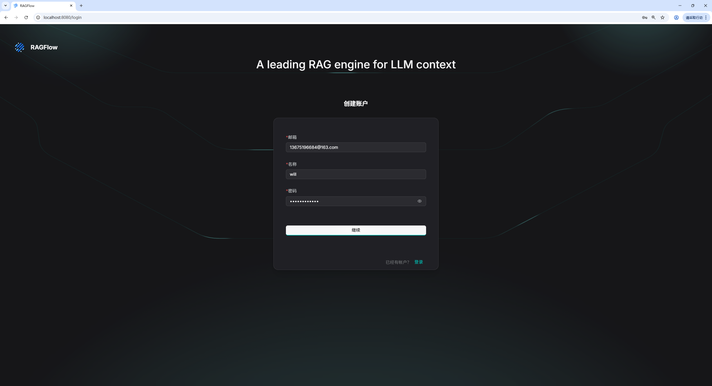


### 卸载RAGFlow


## 使用

参考：https://ragflow.com.cn/docs/dev/


### 模型供应商


#### 模型类别


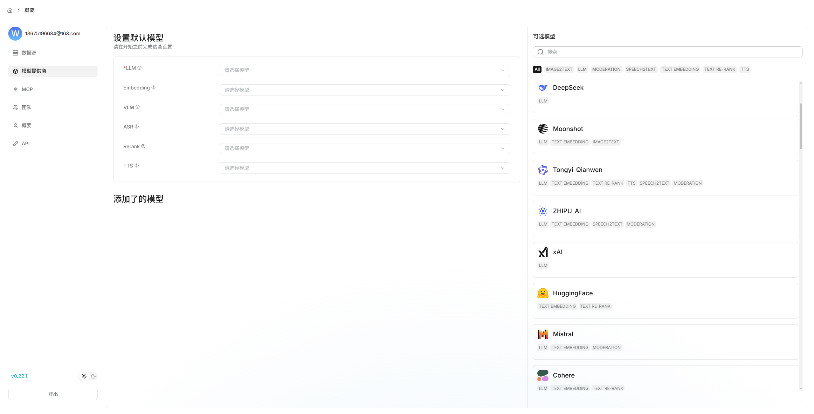

| 模型类型      | 英文全称 / 解释                                | 主要功能与作用简介                                           |
| ------------- | ---------------------------------------------- | ------------------------------------------------------------ |
| **LLM**       | **大型语言模型**  Large Language Model         | 这是AI应用的核心，负责理解和生成人类语言。它可以进行对话、回答问题、撰写文本、翻译、编程等。设置默认LLM意味着为应用选择一个主要的“大脑”。 |
| **Embedding** | **嵌入模型**                                   | 将文本（如单词、句子、文档）转换为一系列数字（向量），这些数字代表了文本的深层含义。主要用于知识库检索、语义搜索、文本分类和聚类等任务，是让AI“理解”文本相似度的基础。 |
| **VLM**       | **视觉语言模型**  Vision-Language Model        | 能够同时处理图像和文本信息的模型。它可以理解图片内容并回答相关问题（视觉问答）、生成图片描述、进行基于图像的对话等。 |
| **ASR**       | **自动语音识别**  Automatic Speech Recognition | 将人类的语音转换为文本。它是语音输入、实时字幕、语音助手等功能的底层技术，是连接现实世界声音与AI文本处理能力的桥梁。 |
| **Rerank**    | **重排序模型**                                 | 在检索增强生成（RAG）等场景中，当从知识库中检索出大量相关文档后，该模型会对这些结果进行精细排序，找出最相关的前几个，从而显著提升最终回答的准确性和质量。 |
| **TTS**       | **文本转语音**  Text-to-Speech                 | 将文本信息转换为逼真的语音输出。它为AI应用提供了语音交互的能力，可以用于有声读物、语音助手、播报系统等。 |


#### 模型配置-xinference


在模型部署阶段已梳理的模型如下

|            |          | LLM                      | Embedding             | Reranker               |
| ---------- | -------- | ------------------------ | --------------------- | ---------------------- |
| xinference | base_url | http://localhost:9997/v1 | http://localhost:9997 | http://localhost:9997  |
|            | api_key  | NA                       | NA                    | NA                     |
|            | model    | my_qwen3_14b             | my_qwen3_embed_0.6b   | my_qwen3_reranker_0.6b |

按以下步骤进行操作

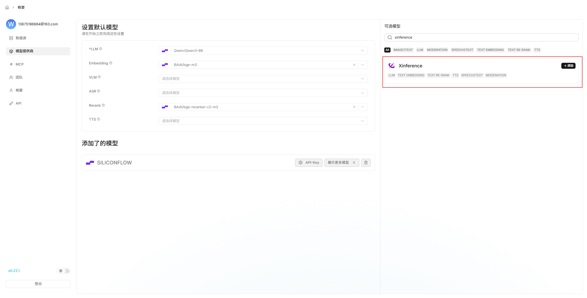


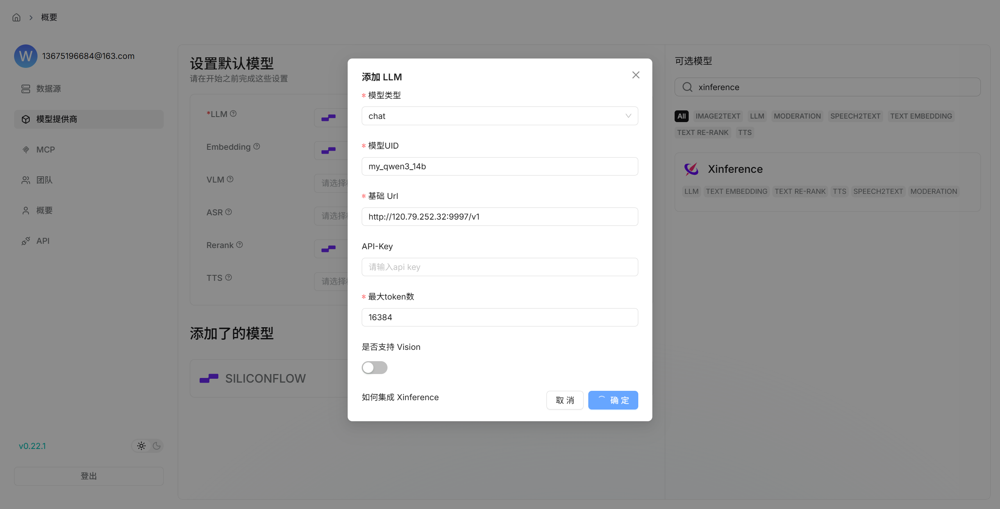


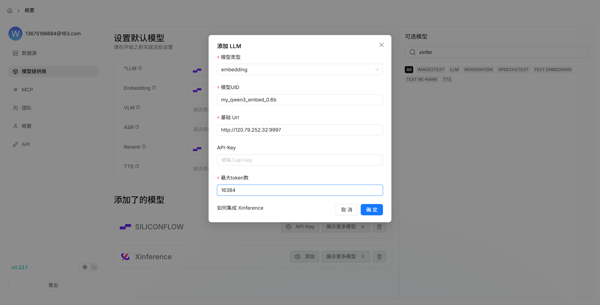


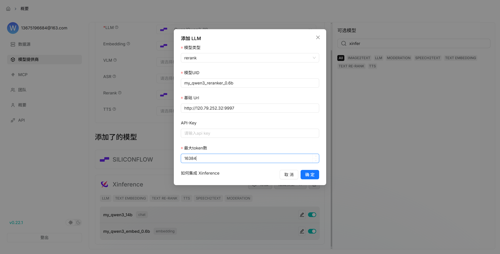


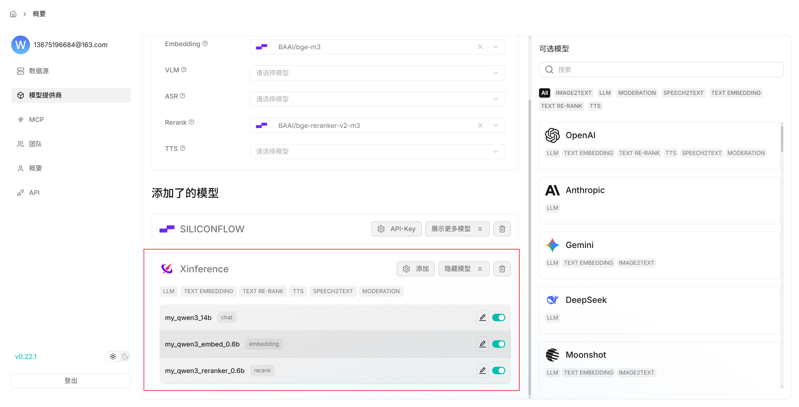


#### 模型配置-vLLM


在模型部署阶段已梳理的模型如下

|      |          | LLM                      | Embedding                | Reranker                 |
| ---- | -------- | ------------------------ | ------------------------ | ------------------------ |
| vLLM | base_url | http://localhost:9992/v1 | http://localhost:8000/v1 | http://localhost:8001/v1 |
|      | api_key  | token-abc123             | NA                       | NA                       |
|      | model    | my_qwen3_14b             | Qwen3-Embedding-0.6B     | Qwen3-Reranker-0.6B      |


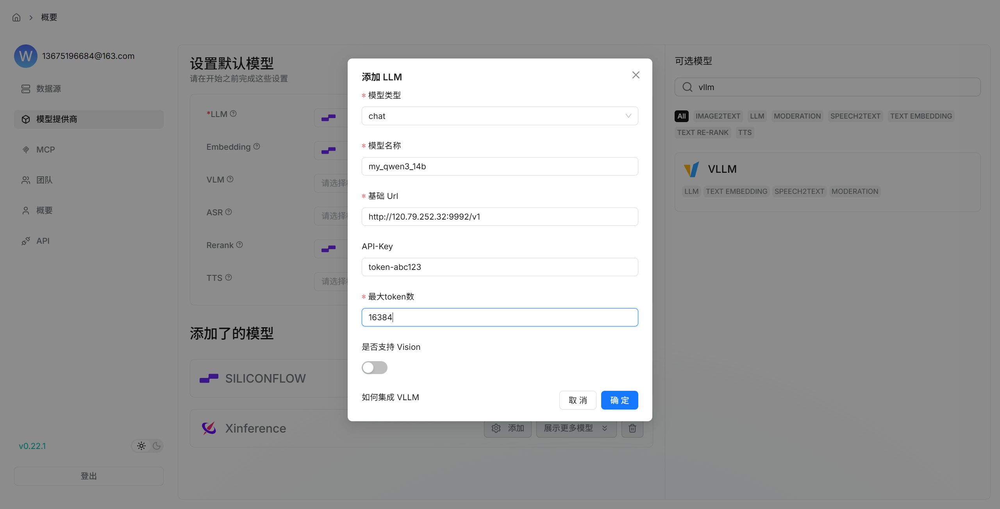


#### 模型配置-Ollama


在模型部署阶段已梳理的模型如下


|        |          | LLM                        | Embedding                        | Reranker                        |
| ------ | -------- | -------------------------- | -------------------------------- | ------------------------------- |
| Ollama | base_url | http://localhost:11434/v1/ | http://localhost:11434           | http://localhost:11434          |
|        | api_key  | NA                         | NA                               | NA                              |
|        | model    | qwen3:8B                   | dengcao/Qwen3-Embedding-0.6B:F16 | dengcao/Qwen3-Reranker-0.6B:F16 |


#### 模型配置-siliconflow


在模型部署阶段已梳理的模型如下

|             |          | LLM                                                         | Embedding                                                   | Reranker                                                    |
| ----------- | -------- | ----------------------------------------------------------- | ----------------------------------------------------------- | ----------------------------------------------------------- |
| siliconflow | base_url | https://api.siliconflow.cn/v1/chat/completions              | https://api.siliconflow.cn/v1/embeddings                    | https://api.siliconflow.cn/v1/rerank                        |
|             | api_key  | Bearer sk-oyynmtyjrsguxrwqdrgyeepzackpwgdrndnzdlydxtjbswup- | Bearer sk-oyynmtyjrsguxrwqdrgyeepzackpwgdrndnzdlydxtjbswup- | Bearer sk-oyynmtyjrsguxrwqdrgyeepzackpwgdrndnzdlydxtjbswup- |
|             | model    | Qwen/Qwen3-8B                                               | BAAI/bge-m3                                                 | BAAI/bge-reranker-v2-m3                                     |

按以下步骤进行操作

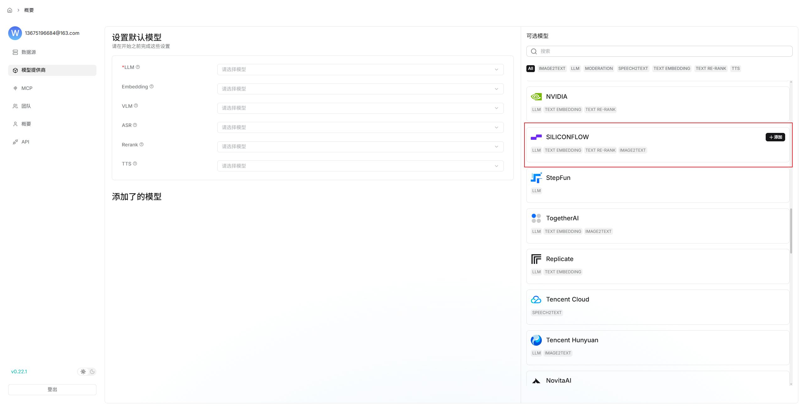


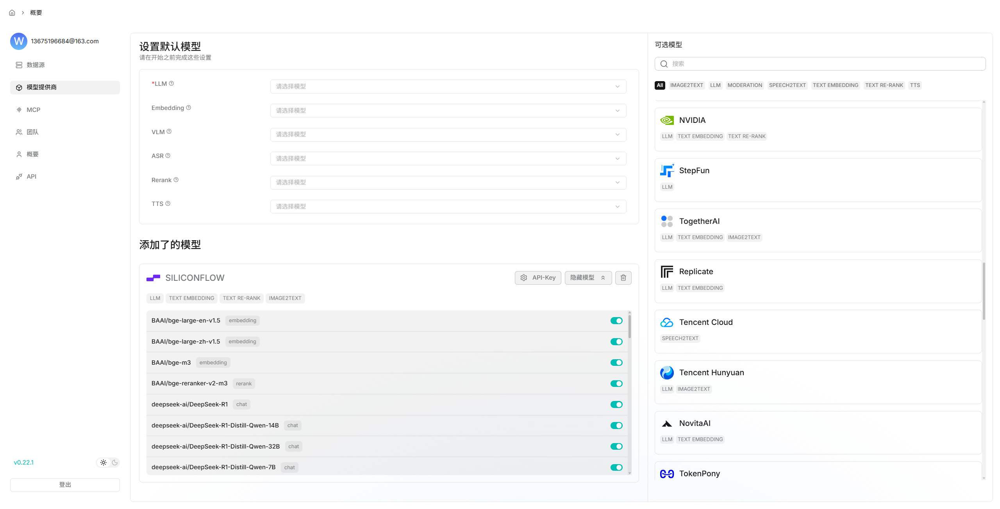


#### 设置默认模型


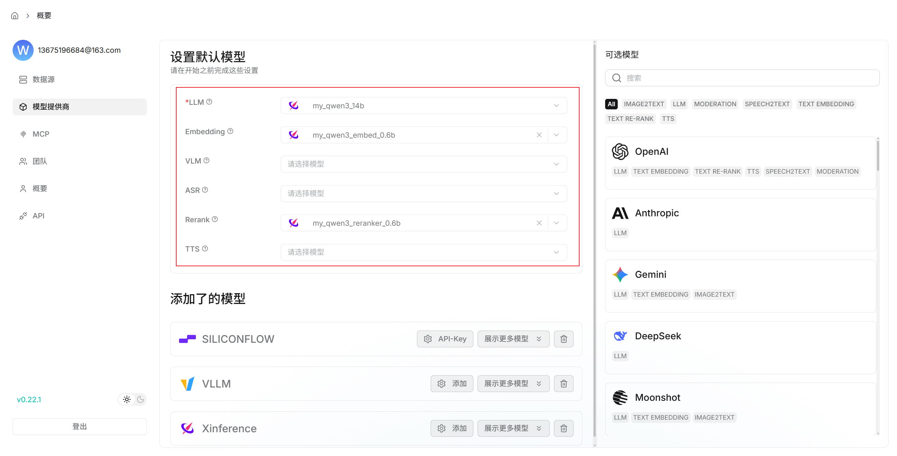


### 创建知识库


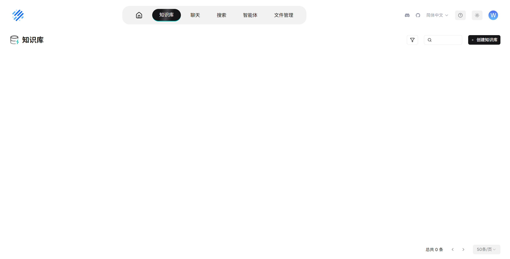


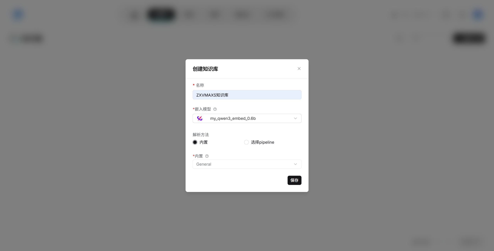


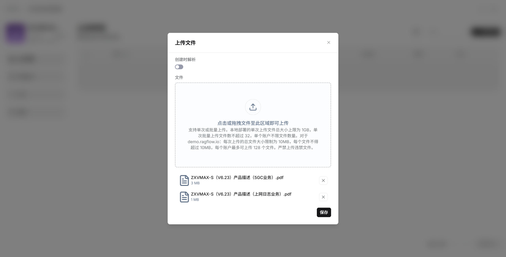


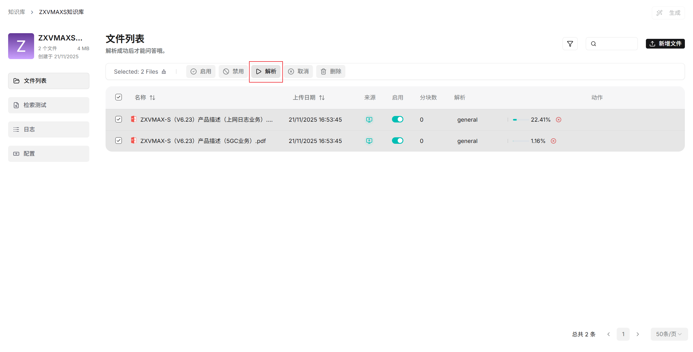


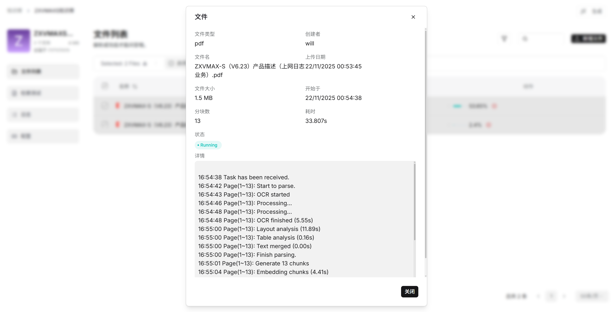


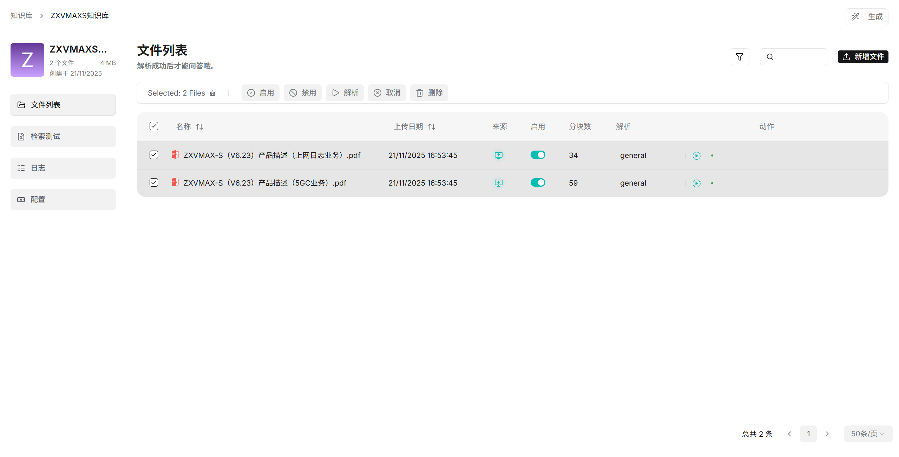

使用知识图谱-GraphRAG


RAGFlow提供了两种不同的方法来处理您数据集中的文档，以优化后续的信息检索效果。这两种方法都是为了更好地理解长文档或复杂文档中的深层信息。

- **知识图谱** 像在做“人物关系图”，侧重于提取事实和关系。
- **RAPTOR** 像在做“章节概要树”，侧重于理解文档的层次和脉络。

| 功能名称     | 核心概念                                                     | 工作原理简介                                                 | 优势与适用场景                                               |
| :----------- | :----------------------------------------------------------- | :----------------------------------------------------------- | :----------------------------------------------------------- |
| **知识图谱** | 从文档中提取出实体（如人物、地点、组织）和实体之间的关系，构建一个语义网络。 | 系统扫描所有文档，识别出关键概念（实体），并判断它们之间如何相互关联（关系），最终形成一个可视化的“知识地图”。 | **优势**：检索时不仅能找到包含关键词的文档，更能通过关系进行智能推理和关联查询。 **适用场景**：分析包含大量事实、事件和对象的文档（如研究报告、公司财报、新闻档案），非常适合探索“实体A和实体B有什么关系？”这类问题。 |
| **RAPTOR**   | 对文档进行递归式的聚类和摘要，构建一个分层的树状结构。       | 1. **分割**：先将长文档切分成小块。 2. **聚类与摘要**：将语义相似的小块聚在一起，并生成一个概括这些小块的摘要。 3. **递归**：将这些摘要再视为新的“文档”，重复聚类和摘要的过程，从而形成一个从细节到主题的多层次结构。 | **优势**：能从不同粒度（从具体细节到核心主题）把握文档整体脉络，避免检索时丢失上下文，尤其擅长处理冗长复杂的文档。 **适用场景**：处理书籍、长报告、学术论文等，当您需要理解文档的宏观主旨而不丢失关键细节时非常有效。 |

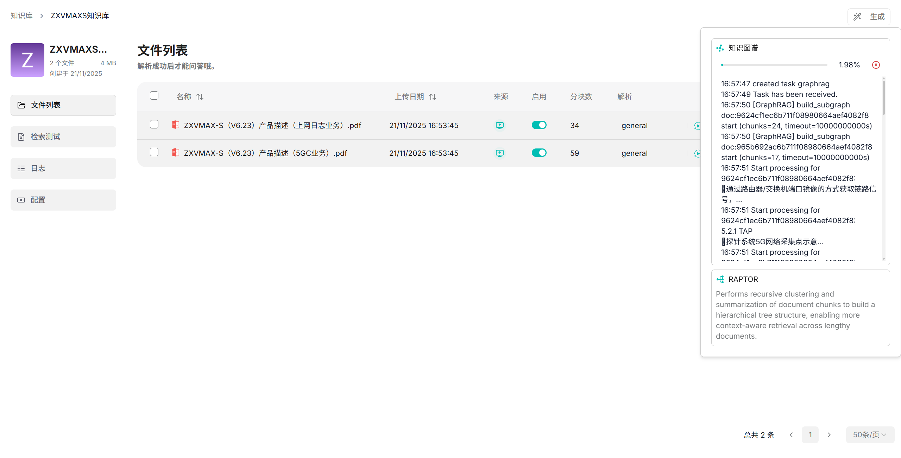


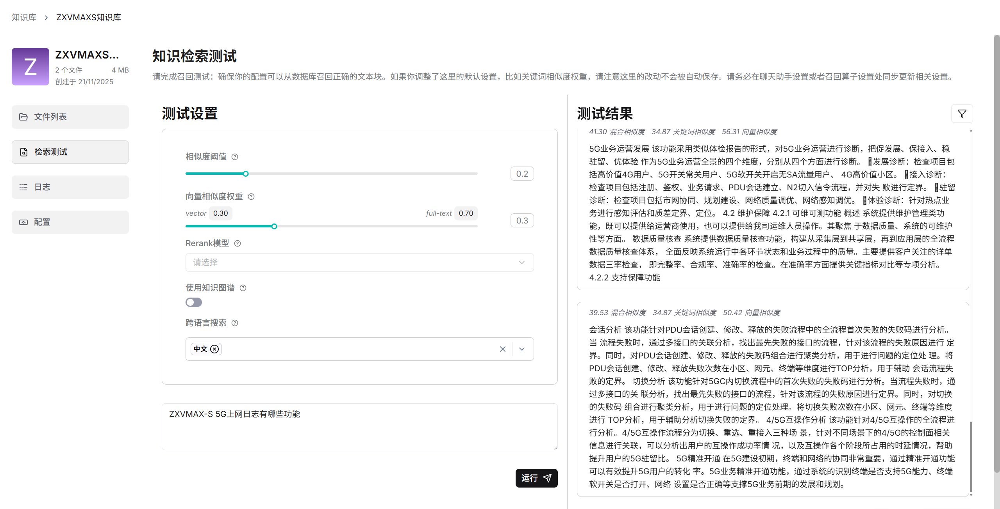


### 创建聊天


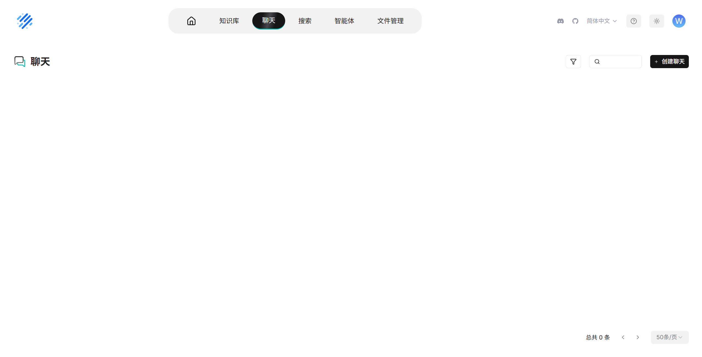


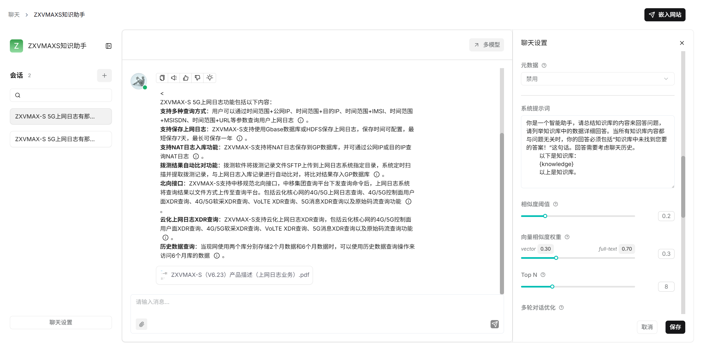


## 解决Redis冲突问题


RAGFlow和Dify共机部署时的场景，Redis可能会冲突，最简单的解决方法： Dify启动时指定名字： `-p dify_docker`


