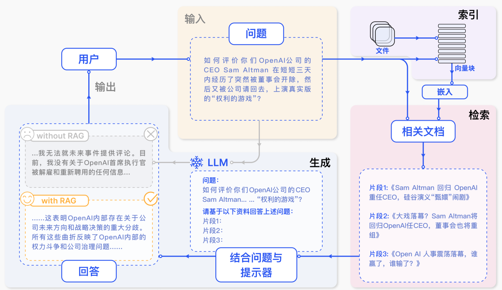

# 轻松学RAG应用开发

<div align=center>

</div>


## 🌟 项目概览

**本项目是基于langchain的大模型RAG外挂知识库的开发教程，主要内容包括：**

1. **大模型简介**，什么是大模型、大模型特点是什么、LangChain 是什么，如何实现RAG；
2. **如何调用大模型 API**，介绍了国内外知名大模型产品 （DeepSeek、智谱AI等）API 的多种调用方式，包括调用原生 API、封装为 LangChain LLM等调用方式；
3. **如何调用本地部署的大模型**，使用ollama/vllm/xinference完成大模型的本地化部署，调用本地大模型的能力；
4. **知识库搭建**，不同类型知识库文档的加载、处理，向量数据库的搭建；
5. **构建 RAG 应用**，包括将 LLM 接入到 LangChain 构建检索问答链，使用 Streamlit 进行应用部署

**如果希望0代码完成本地知识库的搭建，可以借助一些优秀的开源项目：** 

1. [ragflow，一款基于深度文档理解构建的开源 RAG（Retrieval-Augmented Generation）引擎](https://github.com/infiniflow/ragflow/tree/main)
2. [AnythingLLM，一个全栈应用程序，您可以使用现成的商业大语言模型或流行的开源大语言模型，再结合向量数据库解决方案构建一个私有ChatGPT](https://github.com/Mintplex-Labs/anything-llm)
3. [MaxKB = Max Knowledge Base，是一款基于大语言模型和 RAG 的开源知识库问答系统，广泛应用于智能客服、企业内部知识库、学术研究与教育等场景。](https://github.com/1Panel-dev/MaxKB)


## 🛠️ 快速开始

克隆仓库：

```
git clone https://gitee.com/coderwillyan/learn-llm-rag-easily.git
```

安装依赖： 

进入项目llm-rag的根目录，执行pip install指令：

```
pip install -r requirements.txt
```

使用jupyter lab/PyCharm依次执行代码

> 如果chromadb在windows上安装失败，参考：[issues: chromadb fails to install on windows](https://github.com/chroma-core/chroma/issues/189)


## 📂 项目结构

```markdown
learn-llm-rag-easily/
├── 01_RAG理论/          # 核心概念与课程笔记
├── 02_RAG-LangChain实战/ # 完整实现流程
└── assets/              # 图片
└── requirements.txt /   # 依赖
```


## 📜 附RAG





